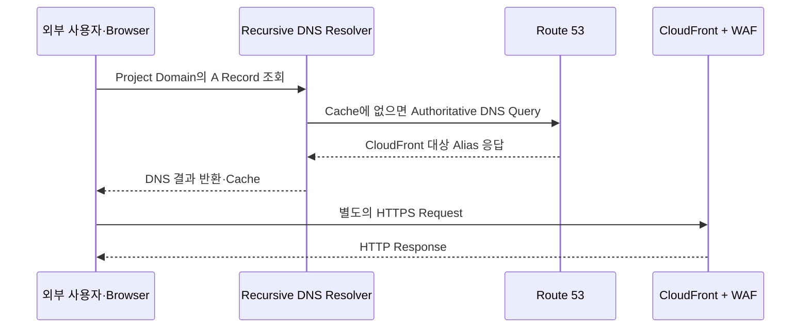

# Amazon Route 53

> [!summary] 이번 노트의 범위
> 전체 지도에서 아래 한 구간만 본다.
>
> ```text
> 외부 사용자·공격자·실습자
> → DNS 조회·HTTP Request
> → Amazon Route 53
> → Amazon CloudFront
> ```
>
> 핵심은 **DNS 조회와 HTTP 요청은 같은 흐름의 연속 단계지만, 같은 통신은 아니라는 것**이다.

## 한 줄 정의

Amazon Route 53은 Domain Name에 대한 DNS Query를 받아, 사용자가 접속해야 할 대상 정보를 반환하는 AWS의 DNS Service다.

우리 프로젝트에서는 Project Domain을 CloudFront Distribution으로 연결하는 **A Alias Record** 역할이 핵심이다.

## 왜 필요한가

CloudFront Distribution에는 AWS가 부여한 Domain Name이 있다.

```text
xxxxxxxxxxxxxx.cloudfront.net
```

이 주소를 사용자가 직접 기억하고 입력하게 할 수도 있지만 다음 문제가 생긴다.

- Service 주소가 Project Domain과 분리된다.
- 사용자에게 의미 있는 이름을 제공하기 어렵다.
- Domain 기반 TLS Certificate와 운영 구조를 연결하기 어렵다.
- CloudFront 교체 시 사용자에게 노출되는 주소까지 바꿔야 할 수 있다.

Route 53의 Hosted Zone과 Alias Record를 사용하면 다음처럼 고정된 Domain을 앞에 둘 수 있다.

```text
Project Domain
→ Route 53 Alias Record
→ CloudFront Distribution
```

CloudFront Distribution이 교체되더라도 DNS Record의 Target만 바꾸면 사용자는 같은 Domain을 계속 사용할 수 있다.

## 가장 중요한 구분: Route 53은 HTTP Proxy가 아니다

잘못 이해하기 쉬운 흐름은 다음과 같다.

```text
Browser → Route 53 → CloudFront → ALB
```

이 그림은 Route 53가 HTTP Request를 받아 CloudFront로 전달하는 것처럼 보이므로 정확하지 않다.

실제 동작은 두 통신으로 나뉜다.

### 1. DNS 조회

```text
Browser·OS
→ Recursive DNS Resolver
→ Route 53 Authoritative Name Server
→ CloudFront에 도달할 수 있는 DNS 응답
→ Browser·OS
```

### 2. HTTPS 요청

```text
Browser
→ DNS 응답으로 알아낸 CloudFront Endpoint
→ CloudFront + AWS WAF
→ ALB
```

Route 53는 **주소를 알려주고 DNS 통신에서 빠진다.**  
그 뒤의 HTTPS Request가 Route 53를 통과하는 것은 아니다.

따라서 현재 프로젝트에서:

- 사건의 시발점: 외부 사용자·공격자·실습자
- 행위 Channel 1: DNS Query
- DNS 응답자: Route 53
- 행위 Channel 2: HTTPS Request
- 첫 HTTP 관측 지점: CloudFront + AWS WAF

로 구분한다.

## 요청 흐름



> [!important] Resolver Cache
> Recursive Resolver나 Client가 기존 DNS 응답을 Cache하고 있다면 매번 Route 53까지 Query가 도달하지 않는다. DNS Query 수와 실제 HTTP Request 수가 일치하지 않는 이유다.

## 핵심 구성요소

### Domain Name

사람이 Service를 찾을 때 사용하는 이름이다.

```text
example.com
```

현재 Repository에서는 실제 값 대신 `var.domain_name`과 Foundation Output을 통해 전달한다.

### Public Hosted Zone

특정 Public Domain과 Subdomain을 Internet에서 어떻게 해석할지 담는 DNS Record Container다.

우리 프로젝트의 Hosted Zone은 Daily Runtime이 새로 만드는 Resource가 아니다. Foundation도 기존 Public Hosted Zone을 `data`로 조회한다.

```hcl
data "aws_route53_zone" "existing" {
  count        = var.domain_name == "" ? 0 : 1
  name         = var.domain_name
  private_zone = false
}
```

즉 Hosted Zone은 Daily Runtime보다 오래 유지되는 외부·영속 기반 Resource다.

### Record

Hosted Zone 내부에서 특정 이름과 Target의 관계를 정의한다.

현재 외부 요청 경로의 핵심 Record는 다음이다.

```hcl
resource "aws_route53_record" "app" {
  count    = local.domain_name == "" ? 0 : 1
  provider = aws.primary
  zone_id  = local.route53_zone_id
  name     = local.domain_name
  type     = "A"

  allow_overwrite = true

  alias {
    name                   = aws_cloudfront_distribution.this.domain_name
    zone_id                = aws_cloudfront_distribution.this.hosted_zone_id
    evaluate_target_health = false
  }
}
```

### Alias Record

Route 53가 제공하는 DNS 확장 기능이다. 현재 프로젝트에서는 Domain의 `A` Record를 CloudFront Distribution으로 연결한다.

일반 CNAME과 달리 Alias는 Zone Apex에도 사용할 수 있다. 따라서 `example.com` 같은 Root Domain을 CloudFront로 연결할 수 있다.

## Terraform Field 해설

| Field | 현재 값·참조 | 역할 |
|---|---|---|
| `count` | Domain이 빈 문자열이면 `0` | Domain을 사용하지 않는 Profile에서는 Record를 만들지 않음 |
| `provider` | `aws.primary` | Primary AWS Provider Context에서 Route 53 Record 관리 |
| `zone_id` | `local.route53_zone_id` | Record를 저장할 기존 Hosted Zone 지정 |
| `name` | `local.domain_name` | 사용자가 입력할 Project Domain |
| `type` | `A` | IPv4 주소 계열과 일부 AWS Resource로 Routing하는 Record Type |
| `allow_overwrite` | `true` | 같은 이름의 기존 Apex A Record를 현재 Alias로 채택·교체 가능하게 함 |
| `alias.name` | CloudFront Distribution Domain | DNS Target 지정 |
| `alias.zone_id` | CloudFront Hosted Zone ID | Alias Target Resource의 Hosted Zone 식별 |
| `evaluate_target_health` | `false` | Route 53가 이 Alias에서 Target Health 평가를 수행하지 않음 |

## 우리 프로젝트에서의 역할

### Foundation 단계

Foundation은 기존 Public Hosted Zone을 조회하고 CloudFront용 ACM Certificate의 DNS Validation Record를 관리한다.

```text
기존 Public Hosted Zone 조회
→ ACM Certificate 요청
→ Route 53에 DNS Validation Record 생성
→ Certificate 검증
```

확인 파일:

```text
foundation/edge.tf
```

### Daily Runtime 단계

Daily Runtime은 CloudFront Distribution을 만든 뒤 Project Domain의 A Alias Record를 CloudFront에 연결한다.

```text
Project Domain
→ Route 53 A Alias
→ CloudFront Distribution
```

확인 파일:

```text
edge.tf
```

### CloudFront와의 계약

CloudFront Distribution에도 같은 Domain이 Alternate Domain Name으로 등록돼야 한다.

```hcl
aliases = local.domain_name == "" ? [] : [local.domain_name]
```

즉 다음 세 요소가 서로 일치해야 한다.

```text
Route 53 Record Name
= CloudFront Alternate Domain Name
= ACM Certificate Domain Name
```

하나라도 다르면 정상적인 Custom Domain HTTPS 연결이 깨질 수 있다.

## 입력과 출력

### 입력

- 사용자가 조회한 Project Domain
- DNS Record Type: 현재 핵심 경로는 `A`
- 기존 Public Hosted Zone
- Alias Target인 CloudFront Distribution
- Resolver와 Client의 Cache 상태

### 출력

- CloudFront에 도달할 수 있도록 하는 DNS 응답
- Resolver Cache에 저장될 DNS 결과

Route 53의 출력은 Web Page나 HTTP Response가 아니다.

## 로그·관측성 관점

### Route 53가 알려줄 수 있는 것

Query Logging을 별도로 구성하면 다음과 같은 DNS 관측이 가능하다.

- 요청된 Domain·Subdomain
- Query 시각
- DNS Record Type
- Query에 응답한 Route 53 Edge Location
- DNS Response Code

### 현재 프로젝트 상태

현재 확인한 Project Terraform Source에서는 Route 53 Public DNS Query Logging 구성을 확인하지 않았다.

따라서 현재 MOC의 외부 Web 관측은 Route 53가 아니라 다음 지점부터 본다.

```text
CloudFront + AWS WAF
```

Route 53는 현재 **요청 Routing을 위한 DNS 계층**이며, CloudFront Access Log처럼 실제 HTTP Request를 보여주는 Log Source로 구성돼 있지 않다.

### Query Logging의 한계

Query Logging을 켜도 모든 Browser 요청이 한 줄씩 기록되는 것은 아니다.

```text
Resolver Cache Hit
→ Route 53로 Query를 다시 보내지 않음
→ Route 53 Query Log에도 새 Event가 없음
```

DNS Query Log는 HTTP Method, URI 처리 결과, WAF Rule Match, Application Login 결과를 보여주지 않는다.

## 직접 확인하는 방법

> [!warning] 아직 Runtime 재검증 전
> 아래 명령은 확인 절차다. 이 노트를 작성하면서 현재 Runtime에 직접 실행한 결과는 아니다.

### 1. Hosted Zone 조회

```powershell
aws route53 list-hosted-zones-by-name `
  --dns-name '<PROJECT_DOMAIN>'
```

확인할 것:

- Domain과 일치하는 Hosted Zone이 존재하는가
- `Id`가 Terraform의 `local.route53_zone_id`와 일치하는가
- Public Hosted Zone인가

### 2. Record 조회

```powershell
aws route53 list-resource-record-sets `
  --hosted-zone-id '<HOSTED_ZONE_ID>' `
  --query "ResourceRecordSets[?Name=='<PROJECT_DOMAIN>.']"
```

기대 구조:

```text
Type: A
AliasTarget.DNSName: <CloudFront Distribution Domain>
EvaluateTargetHealth: false
```

### 3. DNS Resolution 확인

Windows PowerShell:

```powershell
Resolve-DnsName '<PROJECT_DOMAIN>' -Type A
```

또는:

```powershell
nslookup '<PROJECT_DOMAIN>'
```

이 명령은 Domain이 DNS에서 해석되는지 확인한다.  
이 결과만으로 CloudFront·WAF·ALB·DVWA가 정상이라는 뜻은 아니다.

### 4. HTTPS 경로 확인

```powershell
curl.exe -I "https://<PROJECT_DOMAIN>"
```

이 단계부터는 DNS 확인을 넘어 실제 HTTPS Request를 보낸다.

확인할 것:

- DNS Resolution 성공 여부
- TLS 연결 성공 여부
- HTTP Status
- CloudFront를 나타내는 Response Header

### 5. DNS와 HTTP 문제 분리

```text
Resolve-DnsName 실패
→ Route 53·Hosted Zone·Record·Delegation 계층 확인

Resolve-DnsName 성공 + curl 실패
→ CloudFront·TLS·WAF·ALB·Application 계층 확인
```

이 분리가 Route 53를 첫 노트로 공부하는 핵심 이유다.

## 비용과 수명주기

현재 Project에서는 다음 수명주기를 구분한다.

```text
Public Hosted Zone
→ 외부·영속 Infrastructure

ACM DNS Validation Record
→ Foundation에서 관리

Application A Alias Record
→ Daily Runtime에서 관리
```

Daily Runtime을 내린다고 Hosted Zone 자체까지 삭제해서는 안 된다.  
Hosted Zone과 Domain Delegation을 제거하면 다음 Runtime에서 같은 Domain을 즉시 재사용하기 어렵다.

## 보안상 중요한 점

### DNS Record 변경 권한

공격자가 Route 53 Record를 바꿀 수 있으면 사용자를 공격자가 통제하는 Endpoint로 유도할 수 있다.

따라서 다음이 중요하다.

- Route 53 변경 IAM 권한 최소화
- Terraform·CI Role의 대상 Hosted Zone 제한
- Route 53 변경 API를 CloudTrail에서 추적
- 의도하지 않은 Record Overwrite Plan 검토

### `allow_overwrite = true`

현재 Source에는 기존 Apex A Record를 Alias로 채택하거나 교체하기 위해 이 값이 사용된다.

편리하지만 잘못된 Domain·Hosted Zone을 지정한 상태에서 Apply하면 기존 Record를 덮어쓸 수 있으므로 Plan 확인이 필수다.

### Route 53는 TLS를 처리하지 않는다

Route 53는 DNS를 담당한다. HTTPS Certificate 제시와 TLS Session 처리는 CloudFront와 ACM 영역이다.

```text
Route 53
→ 어디로 갈지 알려줌

CloudFront + ACM
→ HTTPS 연결을 실제로 처리
```

## 이 구성요소가 알려주는 것과 한계

### 확인할 수 있는 것

- Project Domain이 어느 AWS Resource로 연결되는가
- Hosted Zone과 Record가 존재하는가
- DNS Query가 성공하는가
- Query Logging 구성 시 어떤 Domain·Type·Response Code가 조회됐는가

### 이것만으로는 확인할 수 없는 것

- WAF가 Request를 COUNT·BLOCK했는가
- ALB가 어느 Target으로 전달했는가
- DVWA 로그인·권한 검사가 성공했는가
- HTTP Response가 정상인가
- Application 내부에서 SQL·Session이 어떻게 처리됐는가

## 현재 이해해야 할 문장

> Route 53는 사용자의 HTTP Request를 CloudFront로 전달하는 Proxy가 아니다.  
> 먼저 Domain에 대한 DNS 응답을 반환하고, Browser가 그 결과를 사용해 CloudFront에 별도의 HTTPS Request를 보낸다.

## 확인 문제

1. Route 53가 HTTP Request를 직접 CloudFront로 전달하는가?
2. DNS 조회 성공과 Web Application 정상 응답은 왜 별개의 검증인가?
3. 현재 Project에서 `A Alias Record`의 Target은 무엇인가?
4. Hosted Zone을 Foundation과 Daily Runtime 중 어느 쪽에서 새로 생성하는가?
5. Route 53 Query Log 수와 실제 Browser Request 수가 같지 않을 수 있는 이유는 무엇인가?

## 다음 노트

```text
[[20_Amazon CloudFront]]
```

Route 53가 알려준 Target으로 Browser가 실제 HTTPS Request를 보내면, 그때부터 CloudFront와 WAF의 HTTP 처리·관측이 시작된다.

## 근거

### 현재 저장소

- `bank-security-lab-infra/foundation/edge.tf`
  - 기존 Public Hosted Zone 조회
  - ACM DNS Validation Record 생성
- `bank-security-lab-infra/edge.tf`
  - CloudFront Alternate Domain Name
  - Project Domain의 Route 53 A Alias Record

### 공식 문서

- Amazon Route 53 Developer Guide — How internet traffic is routed to your website or web application
- Amazon Route 53 Developer Guide — Routing traffic to an Amazon CloudFront distribution by using your domain name
- Amazon Route 53 Developer Guide — Choosing between alias and non-alias records
- Amazon Route 53 Developer Guide — Public DNS query logging

### Runtime Evidence

아직 현재 Runtime에서 직접 재검증하지 않음.
