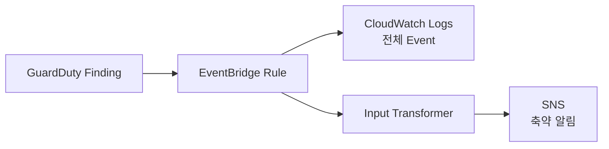

# Amazon EventBridge

> [!abstract]- 프로젝트 로그·관측성 MOC
> ![[00_로그 인프라 전체 흐름#전체 흐름]]

> [!info] 이 노트의 위치
> GuardDuty Finding Event를 Pattern으로 선택해 CloudWatch Logs와 SNS로 분기하는 Event Routing 계층이다.

## 한 줄 정의

Amazon EventBridge는 AWS Service와 Application이 발생시킨 Event를 Rule Pattern으로 선택하고 하나 이상의 Target으로 전달하는 Event Bus 서비스다.

## 핵심 구조

```text
Event Producer
→ Event Bus
→ Rule Event Pattern
→ Target
```

- **Event**: Source, Detail Type, Account, Region, Detail 등을 가진 JSON 문서
- **Rule**: 어떤 Event를 선택할지 정의
- **Target**: 선택된 Event를 전달할 목적지
- **Input Transformer**: Target에 맞게 Event 일부를 재구성

EventBridge는 GuardDuty Finding을 새로 탐지하지 않는다. 이미 생성된 Finding Event를 전달한다.

## 우리 프로젝트에서의 역할

Rule 조건:

```text
source      = aws.guardduty
detail-type = GuardDuty Finding
account     = 현재 AWS Account
```

Target 1 — CloudWatch Logs:

- Log Group: `/aws/events/aws-topology-guardduty-findings`
- Finding Event 전체 보존
- Log Resource Policy로 EventBridge Write 허용
- `RoleArn`을 사용하지 않는 CloudWatch Logs Target 방식

Target 2 — SNS:

- Topic: `aws-topology-security-alerts`
- EventBridge 전용 IAM Role 사용
- Input Transformer로 다음 Field만 전달:
  - Finding ID
  - Finding Type
  - Severity
  - Region
  - Resource Type
  - Time

두 Target 모두 Retry Policy:

- Maximum Event Age: 3600초
- Maximum Retry Attempts: 3

## 흐름



## 저장소에서 찾을 곳

- Rule·Target·IAM·Resource Policy: `foundation/detection.tf`
- Finding Query: `observability/queries/cloudwatch/12_guardduty_findings.cwli`
- F2 검증: `observability/findings/Invoke-F2.ps1`

## 직접 확인하는 방법

```powershell
aws events describe-rule `
  --name aws-topology-guardduty-findings `
  --region ap-northeast-2

aws events list-targets-by-rule `
  --rule aws-topology-guardduty-findings `
  --region ap-northeast-2

aws logs describe-resource-policies --region ap-northeast-2

aws logs filter-log-events `
  --log-group-name /aws/events/aws-topology-guardduty-findings `
  --region ap-northeast-2
```

## 현재 확인 수준

- Event Pattern·Target 2개·Retry·Input Transformer Source: 확인
- 기존 F2 Evidence에는 Sample Finding이 CloudWatch Logs와 SNS로 전달된 기록이 있음
- 최신 Rule State, Target 상태, Retry 실패 여부: 재확인 필요

## 알려주는 것과 한계

### 확인할 수 있는 것

- GuardDuty Finding Event가 Rule과 Match했는가
- 어떤 Target으로 Routing됐는가
- SNS Message에 어떤 Field를 전달하는가

### 이것만으로 확인할 수 없는 것

- Finding이 실제 공격인지 여부
- Target이 최종 구독자에게 반드시 전달됐는지
- CloudWatch Logs·SNS 내부 후속 처리의 성공 여부 전체

## 주의점

- Rule이 `ENABLED`여도 Target IAM·Resource Policy가 틀리면 전달에 실패할 수 있다.
- CloudWatch Logs에는 조사용 전체 Event를, SNS에는 초기 대응에 필요한 최소 Field만 보내는 이유를 구분한다.
- Input Transformer에서 불필요한 Session Metadata나 긴 원문을 알림으로 보내지 않는다.
- EventBridge Event 시각과 GuardDuty Finding의 탐지 시각이 완전히 같은 의미는 아니다.

## 근거

- 현재 저장소: `foundation/detection.tf`
- 공식 문서: https://docs.aws.amazon.com/eventbridge/latest/userguide/eb-events.html
- 공식 문서: https://docs.aws.amazon.com/guardduty/latest/ug/guardduty_findings_eventbridge.html
- Runtime Evidence: 최신 실행 재확인 필요
