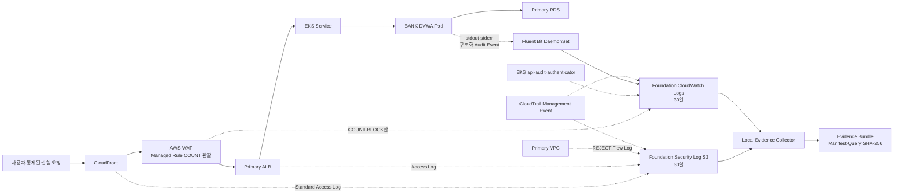

# 관측성 As-built 및 Runtime 검증

> [!important] 판정 경계
> 이 문서는 2026-08-02 Cold Up Runtime과 현재 Source에서 직접 확인한 관측 경로를 기록한다. 로그 목적지가 존재한다는 사실과 공격·탐지 시나리오가 검증됐다는 주장은 구분한다.

## 1. 현재 요청·로그 흐름

## 2. Log Source Runtime 표

| Log Source | 현재 수집 | 저장 위치 | 보존 | Daily Down 후 | 2026-08-02 Runtime 증거 | 판정 |
|---|---:|---|---:|---:|---|---|
| CloudTrail Management Event | 예 | Foundation S3·CloudWatch | 30일 | 보존 | 최근 2시간 S3 193개, Bundle 시간창 23개 | 전달 확인 |
| CloudFront Standard Access Log | 예 | Foundation S3 | 30일 | 보존 | 최근 2시간 4개, Bundle 3개 | 전달 확인 |
| WAF Web ACL Log | 조건부 | Foundation CloudWatch | 30일 | 보존 | 정상 Marker 0건 | `COUNT`·`BLOCK`만 보존하므로 정상 `ALLOW` 0건은 예상 결과 |
| ALB Access Log | 예 | Foundation S3 | 30일 | 보존 | 최근 2시간 3개, Bundle 3개 | 전달 확인 |
| EKS api·audit·authenticator | 예 | Foundation CloudWatch | 30일 | 보존 | Bundle 21,453건 | 전달 확인, 정상 Controller Noise 분류 필요 |
| DVWA stdout·stderr·Audit | 예 | Foundation CloudWatch | 30일 | 보존 | Fresh Marker 1건, Bundle 435건 | Primary 전달 확인 |
| DR DVWA stdout·stderr·Audit | 수집기 준비 | Foundation CloudWatch | 30일 | 보존 | DR Node 1개 Ready·Fluent Bit `1/1`, Bundle 0건 | DR Application Runtime Event는 미발생 |
| Primary VPC Flow `REJECT` | 예 | Foundation S3 | 30일 | 보존 | 최근 2시간 23개, Bundle 13개 | 전달 확인 |

## 3. Cold Up 회귀 증거

- AWS API 보존 확인: CloudTrail·Primary/DR DVWA·EKS·WAF Log Group 모두 30일, Security Log S3의 Current·Noncurrent Object Lifecycle 모두 30일
- Daily Terraform Apply: `256 added / 0 changed / 0 destroyed`
- 소요 시간: 32.9분
- Primary·DR EKS와 RDS 생성 완료
- Primary Node 2개 `Ready`
- Primary Fluent Bit DaemonSet `2/2 Ready`
- Argo CD `Synced / Healthy`
- DVWA Pod `1/1 Running / Ready`
- 배포 Image: `sha-8a0099aa5fe8dda94ef15ac803bdd6ee73cfd413`
- GitOps·Argo Revision: `3be7f3bc43d8f058749909dd9d925722c0ef2256`

## 4. Evidence Bundle 검증

### `observability-cold-up-smoke-20260802`

- 범위: `2026-08-01T19:10:00Z`부터 `19:38:58Z`
- Scenario ID: `WEB-01`
- 성격: 공격 실행이 아닌 정상 관측 Pipeline Baseline
- Collector: CloudTrail·CloudFront·ALB·VPC·EKS·DVWA 성공, WAF·DR DVWA는 0건
- WEB Query 3개: 실행 성공, 결과 0행
- Manifest 등록 파일: 69개
- 파일별 SHA-256 불일치: 0
- 초기 Manifest의 `ArgoRevision` 누락을 발견해 Collector Context를 보정함

### `evidence-context-smoke-20260802`

- Live Argo Revision 기록 확인
- `MissingContext`: 없음
- AWS 변경 없이 Evidence Context만 재검증

### 정상 요청 1건의 계층 간 추적

`2026-08-01T19:28:12Z`의 `GET /login.php` 요청을 Sanitized Evidence에서 다음처럼 연결했다.

| 계층 | 확인된 기록 |
|---|---|
| CloudFront | `19:28:12`, `/login.php`, Viewer 응답 `200`, Client IP와 Edge Request ID 기록 |
| WAF | 0건. 정상 `ALLOW`는 현행 Filter의 저장 대상이 아님 |
| ALB | `19:28:12.824266Z`, `/login.php?[REDACTED_QUERY]`, ALB·Target 응답 `200`, ALB Trace ID 기록 |
| DVWA | `19:28:12.824145Z`, `/login.php?[REDACTED_QUERY]`, 응답 `200`, `Amazon CloudFront` User-Agent 기록 |

이 `GET /login.php`는 Audit Event를 만들지 않아 CloudFront부터 Application까지
하나의 ID로 이어지지는 않지만 UTC 시각, Method, Path, 응답 상태와 요청
흐름이 일치한다. Query String은 Evidence Sanitizer가 의도적으로
제거했으므로 Marker 원문을 보존하지 않았다.

## 5. BANK Audit Event Coverage

현재 Source에서 정적 확인한 Event Type은 다음과 같다.

| 영역 | Event Type | 현재 경계 |
|---|---|---|
| 로그인 | `auth.login.succeeded`, `auth.login.failed` | Primary Runtime에서 실패 Event 전달 확인 |
| 로그아웃 | `auth.logout.succeeded` | Source·Test 확인, 이번 Runtime의 개별 Event 미확인 |
| 회원가입 | `auth.registration.succeeded`, `auth.registration.failed` | 성공·여러 검증 실패 경로에 배치됨 |
| 접근통제 | `authorization.access.denied` | Runtime 전달 확인. 기존 `/` Health Check Noise와 실제 접근 거부를 분류해야 함 |
| CSRF | `security.csrf.failed` | Source 확인, 본편 Runtime 미검증 |
| 보안 수준 | `security.level.changed` | Source 확인, 본편 Runtime 미검증 |

`request_id`는 ALB가 전달한 `X-Amzn-Trace-Id`를 형식 검증 후 우선 사용하고,
없으면 `app-*` ID를 생성한다. 기존 Sanitized Bundle에서
`authorization.access.denied` 2건을 ALB Log와 다시 대조한 결과는 다음과 같다.

| BANK Audit 시각 | ALB 시각 | Path | 결과 | Correlation |
|---|---|---|---|---|
| `19:14:01.095372Z` | `19:14:01.095829Z` | `/` | Application `denied`, ALB `302` | 동일 `Root=...` Trace ID |
| `19:16:27.480619Z` | `19:16:27.481179Z` | `/` | Application `denied`, ALB `302` | 동일 `Root=...` Trace ID |

따라서 **ALB → BANK Audit Event의 직접 1:1 Correlation은 Runtime으로
확인됐다.** CloudFront `x-edge-request-id`는 별도 ID이므로 Edge부터 ALB까지는
여전히 시각·Source IP·Method·Path를 함께 사용한다.

현재 BANK Source에는 실제 계좌 잔액·이체 업무가 구현됐다는 근거가 없어
계좌 조회·이체 Event도 존재하지 않는다. 팀이 해당 기능을 추가하면 기능
성공·실패와 접근 거부를 같은 Audit Helper로 계측해야 하며, 지금 이를
구현 완료라고 표현하지 않는다.

## 6. 확인된 자동화 결함과 보정

### 새 Bastion과 stale `bas` Alias

Daily Up은 새 Bastion을 만들었지만 로컬 SSH Config의 `Host bas`는 이전 Public IP를 유지했다. AWS Runtime은 정상이어도 `argocd-ui.ps1`과 다음 SSH 작업이 Timeout되는 결함이다.

보정 후 Daily Up은 다음을 수행한다.

1. Terraform Output에서 현재 Bastion IPv4를 확인한다.
2. SSH Config의 정확한 단일 `Host bas` Block만 교체한다.
3. 다른 Host Block은 보존한다.
4. Block이 없으면 새로 추가한다.
5. 같은 값으로 재실행해도 파일이 다시 변하지 않는다.

PowerShell Parser와 회귀 Self-test 통과 후 실제 `bas` Alias로 Node 2개와 DVWA Pod Ready를 다시 확인했다.

## 7. 현재 Noise와 미검증

- 현재 Runtime의 ALB Health Check가 `/`에 반복 접근하면서 `authorization.access.denied` Audit Event를 다량 만든다. Terraform 기본 경로를 비인증 `/login.php`로 보정하고 정적 검증은 통과했으나, 실제 Noise 감소는 다음 Daily Up에서 확인해야 한다.
- WAF 정상 `ALLOW` 요청은 비용 통제 Filter 때문에 저장하지 않는다. CloudFront·ALB·Application Log로 정상 요청을 추적하고, WAF는 `COUNT`·`BLOCK` Event에 사용한다.
- ALB `trace_id`와 BANK `request_id`의 직접 연결은 2건 확인했다. CloudFront `x-edge-request-id`는 별도이므로 Edge 구간은 시간·Source IP·Method·Path와 함께 연결해야 한다.
- DR Application Log Group은 준비됐지만 이번 Runtime에서 Event가 없었다.
- Metric Filter·Alarm·SNS와 실제 조치 전·후 공격 시나리오는 아직 실행하지 않았다.
- `WEB-01`·`IAM-01`은 팀이 확정한 공격 주제가 아니라 관측 Pipeline 검증 후보다.
- Athena External Table DDL과 Local Renderer는 실제 CloudFront JSON 8개 Field,
  ALB Regex, VPC 14개 Field Sample에 맞춰 정적 검증했다. AWS Glue/Athena
  Catalog 실행과 Query Runtime은 승인 전이므로 미검증이다.

## 8. 다음 Gate

1. 다음 Daily Up에서 ALB Health Check `/login.php`와 Audit Noise 감소를 Runtime으로 확인한다.
2. 팀이 대표 공격·이상행위 시나리오를 선택한다.
3. 선택된 시나리오에 필요한 Query·Metric Filter·Alarm만 연결한다.
4. Target·요청량·중단 조건을 보고하고 승인받은 뒤 통제된 실험을 수행한다.
5. 조치 전·후 동일 조건 Evidence Bundle을 비교한다.

## 9. Goal 진행 경계

| Phase | 현재 상태 | 완료로 보지 않는 이유·다음 조건 |
|---|---|---|
| 0. Baseline | Runtime 확인 | 현재 표와 Source·State 대조 완료 |
| 1. 시나리오 후보 | 후보 2개 정의 | 팀·멘토의 본편 선택이 아님 |
| 2. 최소 Observability | Runtime 전달 확인 | DR Application Event와 다음 Up의 Health Check 보정은 미검증 |
| 3. BANK Audit Log | Primary Runtime 확인 | 실제 본편 시나리오의 Event 완전성은 미검증 |
| 4. Evidence Collector | Runtime Bundle·Hash 확인 | 실제 실험 Strict Mode는 미실행 |
| 5. Query·탐지·알림 | CWLI Runtime·Athena DDL Source 확인 | Athena Catalog·Query Runtime과 공격 결과에 연결된 Metric Filter·Alarm은 미구현 |
| 6. 통제된 보안 실험 | 미실행 | Target·요청량·중단 조건 승인 필요 |
| 7. Daily Lifecycle | Cold Up 확인 | 09:00 Down과 다음 Up 회귀가 남음 |
| 8. 보고서 산출물 | As-built 초안 | 조치 전·후 비교와 팀 확정 시나리오 증거가 없음 |

따라서 현재 성과는 **배포·로그 전달·증거 수집 기반의 Runtime 검증**이며 Goal 전체 완료가 아니다.

## 10. Goal 완료 조건 증거 감사

| # | 완료 조건 | 현재 증거 | 판정·남은 일 |
|---:|---|---|---|
| 1 | 기존 CI/CD·GitOps 무회귀 | 현재 immutable Image, Argo `Synced / Healthy`, Pod Ready | 부분 충족. Observability 변경 뒤 새 Source Push End-to-End는 재실행하지 않음 |
| 2 | 필요한 Log Source 실제 도착 | CloudTrail·CloudFront·ALB·VPC·EKS·Primary DVWA Runtime 전달, WAF는 `COUNT/BLOCK` Filter | 기반 충족. 확정 시나리오에 필요한 Source와 DR Application Event는 후속 검증 |
| 3 | 구조화 보안 Event와 Secret 제외 | BANK Audit JSON, 금지 Context Allowlist, Sanitized Bundle Secret Pattern 0 | 부분 충족. 로그인·회원가입·접근통제·Security Event는 있으나 계좌·이체 기능 자체가 없음 |
| 4 | 정상 요청 Edge→Application 추적 | `/login.php`의 CloudFront→ALB→DVWA 추적, ALB Trace→BANK Request ID 2건 직접 일치 | 충족 |
| 5 | 대표 시나리오 2개 조치 전 실행 | 없음 | 미충족. 후보만 있고 실행 승인·팀 확정 없음 |
| 6 | 각 시나리오 차단·통과와 Log 설명 | 없음 | 미충족. 정상 Baseline 설명만 존재 |
| 7 | 조치 후 동일 조건 결과 차이 | 없음 | 미충족 |
| 8 | Query Pack과 최소 탐지 규칙 | CWLI 7개 Runtime, Athena Query·DDL·Renderer Source | 부분 충족. Athena Runtime과 시나리오 기반 Metric Filter·Alarm 미구현 |
| 9 | 실험별 Local Evidence Bundle·Hash | 정상 Baseline Bundle 2개, SHA-256 불일치 0 | 부분 충족. 조치 전·후 실험 Bundle 없음 |
| 10 | Down 뒤 AWS Log 30일·Local Evidence 보존 | Retention API·Lifecycle 확인, Local Bundle 존재 | 실행 대기. 09:00 Down 후 Foundation·Bundle 잔존을 재확인해야 함 |
| 11 | 다음 Up에서 Collector·Application 자동 복원 | Daily State 0에서 256개 Cold Up, Fluent Bit·BANK DVWA Ready | 1회 충족. 현재 Down 뒤의 다음 Up에서 Health Check 보정 포함 재검증 필요 |
| 12 | 비용·미구현·미검증·False Positive 공개 | As-built의 Noise·미검증, Query Metadata, 후보 경계 | 충족 |
| 13 | 멘토 비교 평가용 보고서 초안 | [[20_팀 프로젝트/3차 프로젝트/멘토 상담용 관측성 진행 보고 초안]] | 초안 충족. 본편 시나리오 전후 결과는 비어 있음 |
| 14 | 개인 Account와 팀 이식 구분 | 문서에서 개인 Account Runtime과 팀 이식 미검증을 분리 | 부분 충족. 다른 Account·노트북 재생성 Runtime 없음 |

현재 확정 충족은 4·12이며, 13은 본편 결과 전의 진행 초안이다. 나머지를
검증하지 않고 Goal을 완료 처리하지 않는다.
