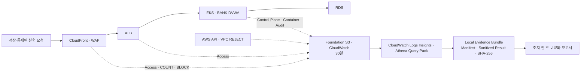

# 멘토 상담용 관측성 진행 보고 초안

> [!important] 현재 판정
> 이 문서는 팀의 최종 공격 주제를 확정하는 제안서가 아니다. 현재까지 실제로 작동시킨 실험 기반과 증거를 보여 주고, 본편 시나리오의 범위와 우선순위를 멘토에게 보정받기 위한 진행 보고다.

## 1. 프로젝트 목적

> 재현 가능한 BANK 웹서비스에서 통제된 보안 행위를 수행하고, 어느 계층에서 차단·통과됐으며 어떤 로그가 남았는지 확인한 뒤, 조치와 동일 조건 재실행으로 통제 효과를 증명한다.

DVWA 배포, Terraform, CI/CD, Kubernetes와 로그 서비스는 목적이 아니라 위 검증을 반복 가능하게 만드는 기반이다.

## 2. 현재 실제로 확인한 기반

| 영역 | 현재 증거 | 판정 경계 |
|---|---|---|
| 재현 가능한 Runtime | `daily-up.ps1`로 Primary·DR EKS/RDS와 BANK DVWA를 생성하고 Argo CD `Synced / Healthy`, Pod Ready 확인 | 개인 AWS Account Runtime 검증이며 팀 Account 이식 완료가 아님 |
| CI/CD·GitOps | GitHub Actions → immutable ECR Image → GitOps Commit → Argo CD → EKS 배포 확인 | 보안 시나리오의 탐지·대응 검증과는 별개 |
| 로그 보존 | CloudTrail·CloudFront·ALB·VPC REJECT·EKS Control Plane·WAF 조건부 Event·BANK DVWA Log를 Foundation S3 또는 CloudWatch에 30일 보존 | WAF 정상 `ALLOW`는 비용 통제 Filter로 저장하지 않음 |
| Application Audit | 로그인·회원가입·접근 거부·Security 변경 등 보안 Event를 구조화 JSON으로 기록하고 Secret·Cookie·Authorization을 제외 | 본편 시나리오 전체 Event 완전성은 아직 미검증 |
| Evidence | Log 원본·Sanitized 결과·Query·Manifest·SHA-256을 Local Bundle로 생성 | 공격 증거가 아니라 정상 관측 Pipeline Baseline |
| 요청 추적 | 같은 `GET /login.php`를 CloudFront → ALB → DVWA에서 시각·Method·Path·응답으로 연결하고, 접근 거부 2건은 ALB Trace ID와 BANK `request_id`가 1:1로 일치 | CloudFront Edge Request ID는 별도라 Edge 구간은 복합 조건으로 연결 |

상세 As-built와 Runtime 수치는 [[20_팀 프로젝트/3차 프로젝트/관측성_As-built_및_Runtime_검증|관측성 As-built 및 Runtime 검증]]에 분리했다.

## 3. 현재 Log 흐름

## 4. 현재 관측 검증 후보

| 후보 | 확인할 보안 질문 | 연결할 계층 | 아직 필요한 결정 |
|---|---|---|---|
| WEB-01 반복 로그인 실패 | 반복 인증 실패가 Application까지 도달하는지, 제한 조치 후 어디서 멈추는지 | CloudFront·WAF·ALB·BANK Audit | WAF Rate Rule과 Application 제한 중 어느 조치를 본편으로 삼을지 |
| IAM-01 Pod Identity 권한 오용 | 임시 Pod가 연계 Role로 Canary S3 객체에 접근하는지, 최소 권한 조치 뒤 같은 접근이 거부되는지 | EKS Audit·Pod Identity·CloudTrail S3 Data Event | BANK 업무에 S3 권한이 실제로 필요한지 |

두 항목은 팀의 최종 공격 주제가 아니라 서로 다른 계층에서 관측 Pipeline을 검증하기 위한 후보다. 실행 계약과 중단 조건은 [[20_팀 프로젝트/3차 프로젝트/보안_실험_시나리오_계약|보안 관측 검증 후보 시나리오]]에 분리했다.

### 2026-08-02 실행 결과

| 후보 | 실제 결과 | 현재 판정 |
|---|---|---|
| WEB-01 | `before/count/block` 각 20회가 모두 HTTP 200. BANK Audit Log는 각 20건, `COUNT` Match 2건, `BLOCK` Match·403은 0건 | Application·일부 WAF 관측 성공. 차단은 미검증 |
| IAM-01 | 조치 전 Pod Identity로 Canary S3 Put/Get/Delete 성공. Role·Policy·Association 6개 제거 후 Credential 없음·S3 Object API 0건. 다음 Cold Up에서도 기본 비활성과 BANK Association 부재 확인 | 최소 권한 조치 전·후 차이와 조치 지속 검증 |

최신 Session에서는 WEB 3개·Athena 4개·DR Event 1개 Bundle의 SHA-256 490개가 모두 일치했다. Final Pre/Post-Down과 JSON Depth 회귀 Bundle도 각각 155·180·57개 불일치 0이다. 이 결과는 관측 Pipeline 검증이며 팀의 본편 시나리오 확정으로 확대하지 않는다.

추가로 로그인 실패 Alarm의 `OK → ALARM → OK`, Athena 4개 Query의 실제 성공, DR Application Event 1건 전달, Daily Down 뒤 Foundation 로그·Local Evidence 보존을 확인했다. SNS Subscription은 0건이어서 외부 알림 수신은 확인하지 않았다.

## 5. 조치 전·후 Evidence Matrix 초안

| 단계 | WEB-01에서 남길 증거 | IAM-01에서 남길 증거 |
|---|---|---|
| 정상 Baseline | 정상 로그인 1회·의도적 실패 1회와 계층별 Log | 기본 ServiceAccount에서 대상 Role이 제공되지 않음 |
| 조치 전 | 동일 Source의 제한된 반복 실패, WAF Action, ALB·Application 도달 | Canary Prefix Put·Get·Delete, `pods/exec`, Role·S3 Data Event |
| 탐지 | 반복 실패 Query 결과와 False Positive | 예상 Actor·ServiceAccount·Role·Object Path Query |
| 최소 조치 | 로그인 경로 Rate Limit 또는 Application 제한 | 불필요 Association 제거 또는 Action·Prefix 최소화 |
| 동일 조건 재검증 | 같은 요청 수·간격에서 차단 지점과 후단 Log 감소 | 같은 Manifest·명령에서 Credential 부재 또는 `AccessDenied` |
| 최종 증거 | 전·후 Bundle, 설정 Diff, Query 결과, SHA-256 | 전·후 Bundle, IAM Diff, Query 결과, SHA-256 |

## 6. 중요 시행착오와 보정

| 문제 | 원인 | 보정·검증 |
|---|---|---|
| 새 Runtime 뒤 `ssh bas` Timeout | 새 Bastion IP와 로컬 SSH Alias가 자동 동기화되지 않음 | Daily Up에서 정확한 `Host bas` Block만 갱신, 실제 Node·Pod 조회 성공 |
| EKS Log 수집의 문자 깨짐 | Windows PowerShell의 기본 Encoding 차이 | UTF-8을 명시하고 PowerShell 5.1·7 양쪽 회귀 Test 통과 |
| Query 결과 0건을 실패로 처리 | PowerShell `$null`과 빈 배열을 같은 방식으로 다루지 못함 | 결과를 배열로 정규화하고 0행 Query Bundle 생성·Hash 검증 |
| 정상 Controller 활동을 공격 후보로 오해 | EKS Audit의 Secret `watch/list` Baseline 미분류 | Actor·Verb를 분류해 Argo·System Controller 정상 Noise로 판정 |
| Health Check가 접근 거부 Event를 반복 생성 | 인증이 필요한 `/`를 ALB Health Check에 사용 | Source를 `/login.php`로 보정, 다음 Up에서 Runtime Noise 감소 확인 예정 |
| IAM Canary가 기술 오류를 권한 거부처럼 표시 | `/dev/null`을 AWS CLI Body로 사용하고 stderr를 억제 | 일반 Temp Payload를 사용하고 AccessDenied·Credential 없음·기술 오류를 분리, 허용·거부 상태 재검증 |
| 실험 단계의 Log가 서로 섞임 | Client 종료 뒤 5분을 Event 조회 Window에도 사용 | Event Tail 2초와 S3 전달 유예 5분을 분리하고 실제 Event Time으로 재필터링 |
| WAF `block` 전환 뒤에도 20회가 모두 통과 | 90초 전파 대기와 약 57초 요청으로 다시 실행했지만 `COUNT` 2건·`BLOCK` 0건. 이전의 짧은 실행시간만으로 설명할 수 없음 | 집계·평가 지연, Rule 설정과 WAF Event를 분리 진단. 차단 성공으로 보지 않음 |
| Evidence JSON이 깊이 30에서 잘림 | AWS 응답이 PowerShell `ConvertTo-Json` 기본 계약보다 깊음 | 직렬화 깊이 100으로 통일하고 40단계 Nested JSON의 최하위 값·Redaction을 PowerShell 5.1·7과 Runtime Bundle로 검증 |

## 7. 아직 완료가 아닌 것

- 팀이 본편으로 채택할 대표 시나리오 2개
- 팀이 확정한 실제 공격·이상행위의 조치 전·후 동일 조건 재검증
- WEB-01 Metric Filter·5분 Alarm은 실제 `OK → ALARM → OK`로 전환됐다. SNS Topic의 확정 Subscription이 0건이어서 외부 알림 수신은 미검증
- WAF Rate Rule이 실제 Match·Block되도록 할 조건과 Rollback 증거
- Health Check `/login.php` 보정 뒤 Audit Noise 감소 Runtime 재검증
- DR Application Event 전달과 Athena Query 4개 Runtime은 확인했지만, 실제 DR BANK 업무 Event와 확정 시나리오 Query는 미검증
- 개인 Account 구현을 팀 Account에서 Credential·State 복사 없이 재생성하는 검증

## 8. 멘토에게 받을 판단

1. 위 두 후보 중 클라우드 보안 운영 프로젝트의 본편으로 더 설득력 있는 중심축은 무엇인가?
2. 4주 프로젝트에서 웹 시나리오 1개와 IAM 시나리오 1개를 전·후 재검증하는 범위가 적절한가?
3. `kubectl exec`로 최초 진입을 통제해 가정하고 이후 Pod Identity 권한을 검증하는 것이 유효한 보안성 점검인가?
4. 로그 원본 전체보다 Query·Timeline·전후 Bundle Hash를 제시하는 증거 구성이 충분한가?
5. 탐지 이후 자동 차단까지 구현해야 하는가, 아니면 사람 승인과 제한된 조치까지가 교육 프로젝트에 적절한가?

## 9. 멘토 답변 기록

| 질문 | 직접 인용 | 답변 요약 | 팀 결정으로 가져갈 항목 |
|---|---|---|---|
| 중심축 |  |  |  |
| 적정 범위 |  |  |  |
| `kubectl exec` 가정 |  |  |  |
| 증거 구성 |  |  |  |
| 자동 조치 경계 |  |  |  |
