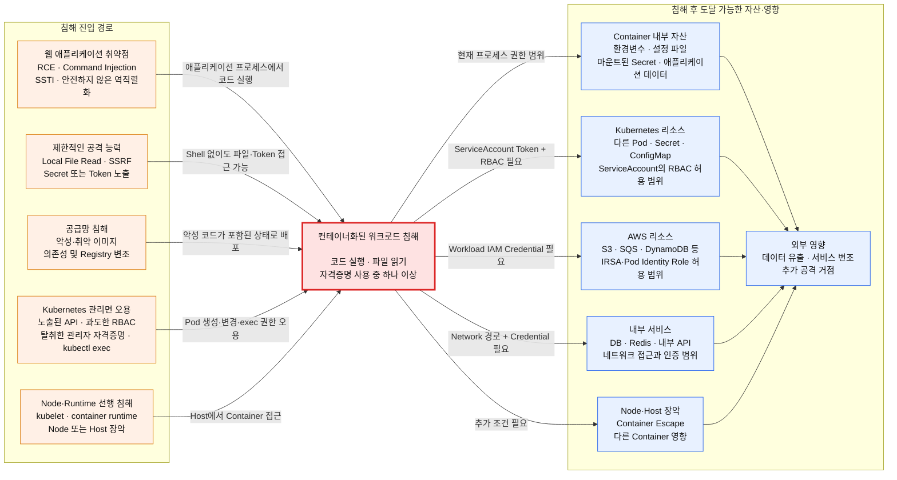
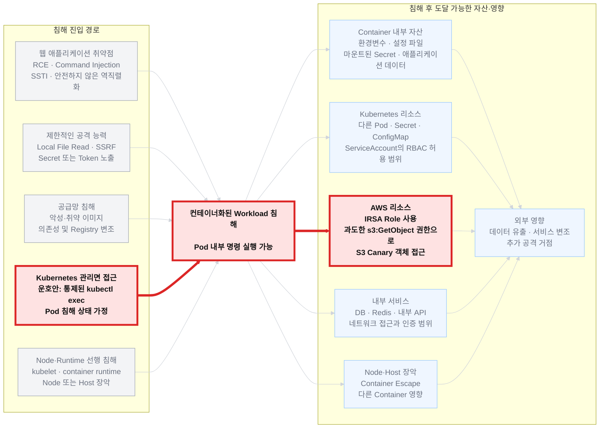
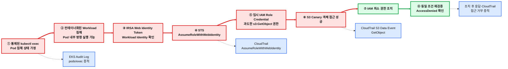

# 2026-07-28 프로젝트 일일 로그

## 오늘 한 줄

- 공격 기법부터 정했던 초기 접근을 돌아보고, **실제 사고 사례 → 보호할 서비스와 인프라 → 공격·장애 검증 → 로그·조치·재점검** 순서로 프로젝트를 다시 이해했다.

## 수행·결과·검증

| 작업                      | 결과                                                                                                                | 검증 / evidence                                  |
| ----------------------- | ----------------------------------------------------------------------------------------------------------------- | ---------------------------------------------- |
| 3개 프로젝트 초안 비교           | 수현안은 구축·인프라·범위에, 타조안과 운호안은 컨테이너 침해·권한 오용에 무게가 있음을 구분했다. 초기에는 타조안을 기반으로 진행하기로 했다.                                  | [[20_팀 프로젝트/3차 프로젝트/RAW_메모]]                   |
| 컨테이너 침해 경로 정리           | 웹 취약점, 제한적 정보 노출, 공급망, Kubernetes 관리면, Node·Runtime 침해에서 Workload와 AWS·Kubernetes·내부 자산으로 이어지는 경로를 Mermaid로 정리했다. | `RAW_메모.md`의 컨테이너 침해 경로 그림                     |
| Container Escape 난이도 검토 | Kernel·Runtime CVE 기반 Escape는 코드 분석 수준으로 난도가 높고, 현재 프로젝트에서는 Misconfiguration·권한 오용이 더 현실적인 출발점이라는 멘토 의견을 확인했다.    | 멘토 상담 녹음 1                                     |
| 진입용 웹앱 후보 검토            | Juice Shop 등 취약 웹앱 후보를 살펴본 뒤 DVWA를 로컬 검증 대상으로 선택했다.                                                               | [[20_팀 프로젝트/3차 프로젝트/RAW_메모]]                   |
| Docker Desktop 환경 준비    | Docker 설치 후 Virtualization 문제를 확인했고, WSL2 설치·재부팅을 거쳐 Linux Container Engine이 정상 기동됨을 확인했다.                        | `docker info`의 WSL2 Kernel·Server 정보           |
| DVWA 배포                 | 공식 Repository를 내려받고 Docker Compose로 DVWA와 MariaDB를 실행했다.                                                          | `docker compose up -d`, `docker compose ps`    |
| DVWA 초기 동작 확인           | Database 생성·초기화, 기본 계정 로그인, Security Level `LOW` 설정, Command Injection의 Self-Ping과 추가 입력을 시험했다.                   | `RAW_메모.md`의 Screenshot 및 실행 기록                |
| 멘토 상담                   | 서비스·인프라 기반이 먼저 필요하며, 공격과 장애는 AWS/Kubernetes 구성요소의 역할과 로그를 확인하기 위한 시험 입력이라는 피드백을 받았다.                              | 멘토 상담 녹음 1·2                                   |
| 녹취 원문 분리                | 잘못 복사된 다글로 전사문에서 중복된 `40:44–42:51` 조각, 녹음 중단·재개 추정 경계, UI 문구를 구분하여 녹음 1·2로 분리했다.                                  | [[20_팀 프로젝트/3차 프로젝트/2026-07-28_멘토상담_녹음_분리_메모]] |
| 상담 해석 재검토               | `보안에 집중한 것이 실수`가 아니라, **보호할 대상과 기반 없이 공격 수단을 먼저 확정한 순서**가 문제였음을 확인했다.                                             | 멘토의 “실수가 아니라 기반만 있으면 된다”는 답변                   |
| 팀 후속 회의                 | 실제 사고 사례를 조사·분석한 뒤 해당 조건을 실험 환경에 구현하는 방향을 논의했다. 2차 인프라를 Terraform으로 재구성하고, 강사 필수 조건인 완전 자동 CI/CD를 추가하는 방향이 공유됐다.  | 2026-07-28 팀 회의 구두 공유, 세부안 미작성                 |

## Docker·DVWA 실행 기록 해석

### 실행한 명령

```bash
docker info
docker compose up -d
docker compose ps
```

### 확인한 내용

- `docker info`
  - Docker Client와 Linux Server가 모두 응답했다.
  - `Kernel Version: ...microsoft-standard-WSL2`로 Docker Desktop이 WSL2 Backend에서 동작함을 확인했다.
  - `seccomp`, `cgroup v2`, `overlayfs`가 적용된 Linux Container 환경이다.
  - 실행 직전에는 `Containers: 0`, `Images: 0`으로 깨끗한 초기 상태였다.
- `docker compose up -d`
  - `mariadb:10`, `ghcr.io/digininja/dvwa:latest` Image를 내려받았다.
  - 전용 Network와 Volume을 만들고 DB·DVWA Container를 시작했다.
- `docker compose ps`
  - `dvwa-db-1`과 `dvwa-dvwa-1`이 모두 `Up` 상태였다.
  - DVWA는 `127.0.0.1:4280→80`으로 Binding되어 외부 Network가 아니라 Localhost에서만 접근 가능했다.

## 오늘 배운 것

### 1. 보안에 집중한 것 자체가 문제는 아니다

- `컨테이너 탈출을 해보자`는 프로젝트 목적이 아니라 검증 수단 또는 시나리오 후보다.
- 먼저 보호할 서비스, 자산, 데이터 흐름, 인프라 구성을 정해야 해당 구조에서 가능한 공격과 필요한 보안 통제를 판단할 수 있다.
- 멘토는 “보안 먼저 생각한 것이 실수인가”라는 질문에 “실수가 아니라 기반만 있으면 된다”고 보정했다.

### 2. 목적·수단·결론을 구분해야 한다

| 구분 | 결정 시점 | 예시 |
|---|---|---|
| 프로젝트 목적 | 구축 전 | Cloud Service를 안정적이고 안전하게 운영하고 통제의 작동을 검증한다. |
| 검증 수단 | 인프라 구성 후 | 실제 사례에 맞는 웹 공격, Misconfiguration, 권한 오용, 장애를 선택한다. |
| 보고서 결론 | 실행 결과 확인 후 | 어떤 통제가 작동했고, 무엇이 통과됐으며, 어떤 조치가 효과가 있었는지 정리한다. |

- 보고서를 쓰면서 발견과 강조점은 다듬을 수 있지만, 실험 목적을 결과에 맞춰 사후 생성해서는 안 된다.

### 3. 설정 경험과 운영 경험은 다르다

- WAF, CloudTrail, CloudWatch, S3, EFS, Auto Scaling 등을 생성·연결한 경험만으로는 각 서비스의 역할을 충분히 설명하기 어렵다.
- 공격, 장애, 부하, 잘못된 설정을 가한 뒤 실제 반응과 로그를 확인해야 운영 경험이 된다.
- 기존 인프라를 더 화려하게 확장하기보다 이미 배운 Resource를 실제 상황에서 최대한 활용하는 편이 중요하다.

### 4. 공격이 막히는 것도 유효한 결과다

- 프로젝트의 성공 조건은 반드시 침투에 성공하는 것이 아니다.
- WAF 등에서 공격이 막혔다면 다음을 증거로 남길 수 있다.
  - 어떤 요청이 차단됐는가
  - 어떤 Rule이 작동했는가
  - WAF·Application·CloudTrail·GuardDuty 등에 무엇이 남았는가
  - 다른 요청은 왜 통과했는가
- 조치 후 같은 조건으로 다시 공격·오류를 발생시켜 결과가 달라졌는지 확인해야 한다.

### 5. 장애도 프로젝트의 보안·운영 실험이다

- Kubernetes Cluster와 Workload를 운영하면서 통제된 장애를 발생시키고 오류와 복구 과정을 확인할 수 있다.
- 어떤 로그를 수집하고 어떤 Dashboard를 만들지는 장애를 실제로 겪은 뒤 판단해야 한다.
- 가용성, 복구, 관측 가능성도 안전한 Cloud Service의 일부다.

### 6. Cloud 사고는 Misconfiguration과 권한 문제가 중요하다

- 멘토는 이전 상담에 이어 AWS 개인정보 노출 사고에서 설정 오류가 중요한 원인이 된다고 반복해서 설명했다.
- IAM은 대표 축이지만 다음을 함께 봐야 한다.
  - IAM·RBAC 과권한
  - Resource Policy와 공개 접근
  - Credential 노출
  - Network·Security Group 설정
  - Logging·감사·암호화 설정 누락
- 실제 사례 조사에서는 화려한 취약점 이름보다 어떤 설정과 신뢰 관계가 피해 경로를 만들었는지를 분석해야 한다.

### 7. 멘토 상담은 문제를 대신 찾아주는 보안 컨설팅이 아니다

- 아무 기반 없이 질문을 던지고 멘토가 프로젝트를 설계해주는 방식이 아니다.
- 팀이 구성도와 가설을 먼저 제시하고 다음을 함께 검토하는 방식이다.
  - 이 공격이 실제 구조에서 가능한가
  - 이 보안 설정이 적절한가
  - 이 로그가 증거로 충분한가
  - 범위와 깊이가 프로젝트 성격에 맞는가
- 다음 상담에는 질문 목록보다 Architecture와 검증 가설이 먼저 필요하다.

### 8. 한 취약점과 여러 취약점은 단순 양자택일이 아니다

- 녹취에는 두 멘토가 `하나를 깊게`와 `여러 개를 검증`으로 잠시 다른 의견을 낸 구간이 있다.
- 이번 Cloud 운영 프로젝트에 맞는 안전한 해석은 다음과 같다.
  - Kernel CVE 하나를 과도하게 깊게 파지 않는다.
  - 관련 없는 공격을 수십 개 나열하지 않는다.
  - 실제 사고 사례 하나의 공격 경로에 포함된 대표 행위들로 여러 구성요소의 반응을 확인한다.

### 9. AI·ML 분석은 데이터가 생긴 뒤에 검토한다

- 현재는 학습할 공격 데이터와 검증된 결과가 없다.
- Dataset과 Feature 없이 모델부터 정하면 이전과 같이 수단을 목적보다 먼저 정하는 문제가 반복된다.
- 우선순위는 `실험 → 로그 수집 → 정탐·오탐 판정 → 데이터 구조화 → AI 활용 검토`다.
- LLM을 이용한 설명·요약 보조는 가능하지만, 별도 Model 학습은 현재 프로젝트 범위보다 크다는 의견을 들었다.

### 10. 시행착오는 실시간으로 기록해야 한다

- 강사와 멘토 모두 성공 결과뿐 아니라 문제 발생, 원인 분석, 조치, 재검증 과정을 강조했다.
- 보고서 작성 시점에 기억으로 복원하지 말고 다음 형식으로 즉시 남겨야 한다.

```text
시도한 것:
기대한 결과:
실제 결과:
증거·로그:
추정한 원인:
변경한 조치:
재검증 결과:
배운 점:
```

### 11. 발표와 Portfolio는 모르는 사람에게 설명하는 글이다

- 첫 목차에서 “우리 조가 무엇을 했는가”가 바로 보여야 한다.
- 최종 결과만 보여주기보다 실제로 경험한 문제와 해결 과정을 설명해야 한다.
- 기술 이름을 나열하기보다 `왜 필요했는지`, `어떤 상황에서 작동했는지`, `무엇으로 확인했는지`를 설명해야 한다.

## 결정

| 결정 | 이유 | 영향 |
|---|---|---|
| 기존 2차 인프라를 출발점으로 재활용 | 기반 없이 공격부터 정했던 문제를 피하고, 이미 배운 AWS Resource를 운영 관점에서 검증하기 위함 | 신규 Architecture 확장보다 Terraform 전환과 실제 동작 검증에 집중 |
| 인프라를 Terraform으로 재구성 | 재현 가능한 배포와 변경 이력 확보 | 2차 설계를 실제 코드로 옮길 범위를 먼저 확정해야 함 |
| 완전 자동 CI/CD를 포함 | 강사 필수 조건 | 취약·조치 Version의 Build·배포·재검증 흐름과 연결 가능 |
| 실제 사고 사례를 먼저 조사 | 임의의 취약점 나열을 피하고 공격 조건과 피해 경로의 근거를 확보하기 위함 | 사례 선정 전 DVWA 개조 범위를 확정하지 않음 |
| DVWA 사용 가능 | 멘토 답변을 재확인하여 `새 웹앱을 반드시 직접 개발해야 한다`는 오해를 해소함 | 사례에 맞는 기능만 수정·확장하는 후보로 유지 |
| 공격 차단도 결과로 기록 | 통제의 작동을 확인하는 것이 프로젝트 목적에 포함됨 | 성공·실패 이분법 대신 차단·탐지·통과 이유를 증거화 |

## 막힌 점

| 문제 | 확인한 사실 | 다음 확인 |
|---|---|---|
| 재현할 실제 사고 사례 미선정 | Misconfiguration·IAM·Resource Policy·Credential·웹 진입점이 유력한 조사 축이다. | 팀이 사례 후보와 선정 기준을 합의해야 함 |
| 보호할 서비스의 구체적 목적 미정 | DVWA 사용은 가능하지만 실제 사례와 어떤 기능을 연결할지는 미정이다. | 서비스·사용자·보호 데이터·정상 흐름을 먼저 정의 |
| Terraform 재사용 범위 미정 | 2차 Architecture를 출발점으로 삼는 방향만 공유됨 | 실제 2차 원본, 변경 대상, 신규 CI/CD Resource를 확인 |
| CI/CD 구현 방식 미정 | 완전 자동화가 필수 조건이라는 점만 확인됨 | Repository, Build Artifact, Image Registry, 배포 Target, 취약·조치 Version 전략 결정 |
| 로그·증적 Mapping 미정 | 공격·장애 후 WAF·Application·CloudTrail·GuardDuty 등의 결과를 보라는 방향은 확인됨 | 사례와 Architecture가 확정된 뒤 Event별 관측 지점 표 작성 |
| 상담 녹취 일부 누락 | 녹음 중단·재개가 있었고 연속 전사문은 화자·시간 정보가 사라짐 | 누락 내용을 추정하지 않고 현재 분리본을 근거로 사용 |

## 보안·비용·운영 주의

- DVWA는 의도적으로 취약하므로 현재처럼 `127.0.0.1`에만 Binding하고 외부에 공개하지 않는다.
- AWS에 배포할 경우 Test Account·격리된 Network·접근 제한·비용 한도를 먼저 정한다.
- 실제 Credential, IAM Token, Cookie, Secret, 개인정보는 로그·보고서·Screenshot에 남기지 않는다.
- 공격 실험은 팀이 소유하고 허가한 환경에서만 수행한다.
- Shield, CloudFront, WAF, GuardDuty 등은 비용과 지원 범위를 확인하고, 실제 구축과 설계만 한 항목을 구분한다.
- `CI/CD 완전 자동화`가 의도적으로 취약한 Version을 외부에 자동 공개하는 구조가 되지 않도록 배포 환경을 격리한다.

## 다음 작업

- [ ] 실제 Cloud·Container 보안 사고 사례 후보를 수집한다.
- [ ] 사례마다 `원인 설정 → 진입점 → 권한·데이터 흐름 → 피해 → 탐지·조치`를 비교한다.
- [ ] 보호할 서비스, 사용자, 데이터, 정상 요청 흐름을 한 장으로 정의한다.
- [ ] 2차 Architecture에서 실제로 재사용할 Resource와 Terraform 전환 범위를 확인한다.
- [ ] 완전 자동 CI/CD의 Build·Registry·Deploy 흐름과 성공 기준을 강사 요구사항에 맞춰 정한다.
- [ ] 선정한 사례가 DVWA 수정으로 재현 가능한지 판단하고 필요한 기능만 설계한다.
- [ ] 공격·장애별 WAF·Application·CloudTrail·GuardDuty·Kubernetes Log 증적 Mapping 표를 만든다.
- [ ] 다음 멘토 상담에는 구성도, 실제 사례, 검증 가설, 확인하고 싶은 판정 기준을 가져간다.
- [ ] 시행착오 발생 시 정해진 형식으로 `RAW_메모.md`에 즉시 기록한다.

## 보고서 재료

- 성과:
  - Container 침해 전후의 공격 경로를 구조화하고 개인안의 IAM 권한 오용 경로를 구체화했다.
  - Docker Desktop·WSL2 환경을 준비하고 DVWA를 실제로 배포·접속·초기 검증했다.
  - 상담을 통해 공격 성공 중심에서 Cloud Resource의 역할·탐지·가용성·조치 검증 중심으로 관점을 보정했다.
- 시행착오:
  - Container Escape와 공격 수단을 먼저 정하고 이를 위한 인프라를 역으로 만들려 했다.
  - 멘토 상담을 팀 구성을 대신 설계해주는 보안 컨설팅으로 오해했다.
  - `보안에 집중한 것이 실수`라고 과도하게 해석했으나, 실제 피드백은 기반과 순서의 문제였다.
  - `DVWA를 사용하지 말라`고 잘못 이해했다가 상담 중 재확인하여 정정했다.
  - Docker Desktop 설치 후 Virtualization을 인식하지 못해 WSL2 설치와 재부팅이 필요했다.
- 그림 / 표 후보:
  - `초기 공격 우선 순서`와 `보정된 서비스·인프라 우선 순서` 비교
  - 실제 사고의 공격·권한·데이터·로그 흐름
  - Terraform → CI/CD → 취약 Version → 공격 → 조치 Version → 재검증
  - AWS/Kubernetes 구성요소별 정상 역할·공격 시 반응·증적 Mapping

# 로그 재료

- 계획 선정.
	- 수현님, 타조, 나 3개의 계획 초안이 나옴.
	- 수현님의 계획은 보안보다는 구축, 인프라, 범위 특화. 나와 타조는 보안 → 컨테이너 침해,침투에 집중.
	- 점심 먹고오니 타조의 계획으로 진행 되기로 함. 다만, 아직 이글루 멘토님들과 상담 전이라, 테세우스의 배마냥 갈가리 찢길 가능성이 없는건 아님.
	- 일단 역할 배정은 웹 앱을 하기로 함.
- 컨테이너 침투, 탈출 경로 공부 모음.

이건 전체.


이건 내 기존 계획의 경우.

자세히 보면 이렇게.
- 웹 앱
	- 만들기 귀찮. 있는거 갖다 쓰기로 함.
	- juice shop은 이미 알고 있었음. 다만 코덱스가 말하는게 이거 주스샵은 우리 프로젝트에 부적합할지도 모른단 느낌이 들어, 주스샵과 비슷한 애들 모두 모아서 적합한 애를 골라냄.
	- DVWA 채택. 근데 뭐라 읽는거지. 드브와?
	- 채택 후 검증을 위해 도커 설치
	- WSL이 없음. 설치 후 재시작.
	- https://github.com/digininja/DVWA 클론으로 다운. 그 다음 까먹었다.
```
{{도커 설치, 업로드, 실행 등 너가 알려준 명령어들 여기에 기록해줘.}}
```

```bash
Unoh@Unoh MINGW64 /d/DVWA (master)
$ docker info
Client:
 Version:    29.6.2
 Context:    desktop-linux
 Debug Mode: false
 Plugins:
  agent: Docker AI Agent Runner (Docker Inc.)
    Version:  v1.111.0
    Path:     C:\Users\Unoh\.docker\cli-plugins\docker-agent.exe
  ai: Docker AI Agent - Ask Gordon (Docker Inc.)
    Version:  v1.27.0
    Path:     C:\Users\Unoh\.docker\cli-plugins\docker-ai.exe
  buildx: Docker Buildx (Docker Inc.)
    Version:  v0.35.0-desktop.2
    Path:     C:\Users\Unoh\.docker\cli-plugins\docker-buildx.exe
  compose: Docker Compose (Docker Inc.)
    Version:  v5.3.1
    Path:     C:\Users\Unoh\.docker\cli-plugins\docker-compose.exe
  debug: Get a shell into any image or container (Docker Inc.)
    Version:  0.0.47
    Path:     C:\Users\Unoh\.docker\cli-plugins\docker-debug.exe
  desktop: Docker Desktop commands (Docker Inc.)
    Version:  v0.4.3
    Path:     C:\Users\Unoh\.docker\cli-plugins\docker-desktop.exe
  dhi: CLI for managing Docker Hardened Images (Docker Inc.)
    Version:  v0.0.7
    Path:     C:\Users\Unoh\.docker\cli-plugins\docker-dhi.exe
  extension: Manages Docker extensions (Docker Inc.)
    Version:  v0.2.31
    Path:     C:\Users\Unoh\.docker\cli-plugins\docker-extension.exe
  init: Creates Docker-related starter files for your project (Docker Inc.)
    Version:  v1.4.0
    Path:     C:\Users\Unoh\.docker\cli-plugins\docker-init.exe
  mcp: Docker MCP Plugin (Docker Inc.)
    Version:  v0.43.3
    Path:     C:\Users\Unoh\.docker\cli-plugins\docker-mcp.exe
  model: Docker Model Runner (Docker Inc.)
    Version:  v1.2.6
    Path:     C:\Users\Unoh\.docker\cli-plugins\docker-model.exe
  offload: Docker Offload (Docker Inc.)
    Version:  v0.6.9
    Path:     C:\Users\Unoh\.docker\cli-plugins\docker-offload.exe
  pass: Docker Pass Secrets Manager Plugin (beta) (Docker Inc.)
    Version:  v0.2.0
    Path:     C:\Users\Unoh\.docker\cli-plugins\docker-pass.exe
  sandbox: "docker sandbox" is deprecated, use Docker Sandboxes instead (Docker Inc.)
    Version:  v0.13.0
    Path:     C:\Users\Unoh\.docker\cli-plugins\docker-sandbox.exe
  scout: Docker Scout (Docker Inc.)
    Version:  v1.23.1
    Path:     C:\Users\Unoh\.docker\cli-plugins\docker-scout.exe

Server:
 Containers: 0
  Running: 0
  Paused: 0
  Stopped: 0
 Images: 0
 Server Version: 29.6.2
 Storage Driver: overlayfs
  driver-type: io.containerd.snapshotter.v1
 Logging Driver: json-file
 Cgroup Driver: cgroupfs
 Cgroup Version: 2
 Plugins:
  Volume: local
  Network: bridge host ipvlan macvlan null overlay
  Log: awslogs fluentd gcplogs gelf journald json-file local splunk syslog
 CDI spec directories:
  /etc/cdi
  /var/run/cdi
 Discovered Devices:
  cdi: docker.com/gpu=webgpu
 Swarm: inactive
 Runtimes: io.containerd.runc.v2 nvidia runc
 Default Runtime: runc
 Init Binary: docker-init
 containerd version: e53c7c1516c3b2bff98eb76f1f4117477e6f4e66
 runc version: v1.3.6-0-g491b69ba
 init version: de40ad0
 Security Options:
  seccomp
   Profile: builtin
  cgroupns
 Kernel Version: 6.18.33.2-microsoft-standard-WSL2
 Operating System: Docker Desktop
 OSType: linux
 Architecture: x86_64
 CPUs: 16
 Total Memory: 15.25GiB
 Name: docker-desktop
 ID: 759dcd46-358e-4255-865e-f212e5b3195f
 Docker Root Dir: /var/lib/docker
 Debug Mode: false
 HTTP Proxy: http.docker.internal:3128
 HTTPS Proxy: http.docker.internal:3128
 No Proxy: hubproxy.docker.internal
 Labels:
  com.docker.desktop.address=npipe://\\.\pipe\docker_cli
 Experimental: false
 Insecure Registries:
  hubproxy.docker.internal:5555
  ::1/128
  127.0.0.0/8
 Live Restore Enabled: false
 Firewall Backend: iptables

Unoh@Unoh MINGW64 /d/DVWA (master)
$ docker compose up -d
[+] up 36/36
 ✔ Image docker.io/library/mariadb:10  Pulled                                                  28.3s
 ✔ Image ghcr.io/digininja/dvwa:latest Pulled                                                  74.9s
 ✔ Network dvwa_dvwa                   Created                                                  0.1s
 ✔ Volume dvwa_dvwa                    Created                                                  0.0s
 ✔ Container dvwa-db-1                 Started                                                  1.1s
 ✔ Container dvwa-dvwa-1               Started                                                  0.9s

Unoh@Unoh MINGW64 /d/DVWA (master)
$ docker compose ps
NAME          IMAGE                           COMMAND                   SERVICE   CREATED         STATUS         PORTS
dvwa-db-1     docker.io/library/mariadb:10    "docker-entrypoint.s…"   db        5 minutes ago   Up 5 minutes   3306/tcp
dvwa-dvwa-1   ghcr.io/digininja/dvwa:latest   "docker-php-entrypoi…"   dvwa      5 minutes ago   Up 5 minutes   127.0.0.1:4280->80/tcp


{{명령어들이랑 출력된 것들 해석해주라.}}
```
![[Pasted image 20260728151419.png]]
> admin,password

![[Pasted image 20260728151501.png]]
드브와 최초 접속이라 DB를 만들라는 화면이다. 아래 `Create / Reset Database` 누르면 됨
그럼 로긴 화면으로 돌아옴. 다시 로긴.
![[Pasted image 20260728152007.png]]
생긴게 이 모양이라 비상이다. 발표용으로 쓰기엔 좀 부적합하다.
다만 코덱스 왈, 재조립이 쉬운 구조라 한다. 나중에 디브와를 재조립하여, 보기좋고 시연에 좋은 형태로 재가공 하자. 일단 당장의 목표는 그게 아니니 인지만 하고 넘어간다.

![[Pasted image 20260728152849.png]]
DVWA Security → LOW로 변경 → 서밋.
![[Pasted image 20260728152959.png]]
커맨드 인젝션 → 시험삼아 셀프 핑.
이후 인젝션 해봄.


## 멘토님 상담
- 애초에 드브와를 보호하는 AWS 보안 서비스가 너무 많다. WAF 라던가.
  이때 waf엔 어떤 로그가 남고,트레일ㅇㄴ 뭐가 남고, 가드 듀티엔 뭐가 남고, 이런걸 기대 중이시다. 
- 장애를 한번 내봐라.
- 몇년 전 AWS 의 개인 정보가 크게 털린 적 있다.
  원인ㅇㄴ IAM 설정 문제. 
- 보안을 먼저한건 실수였다. 인프라 등을 기반을 다져놔야 질문이나 티키타카가 된다.
- **공격 해보고, 장애 일으켜봐라.**
- 메가존도 그렇고, 등등 그렇고, 사용 중인 서비스를 알아야한다.

### 16:45

- 멘토 피드백: DVWA를 프로젝트의 최종 웹앱으로 사용하지 말고 새 웹앱을 직접 만들 것.
- 남음: 새 웹앱의 기능, 취약점, 인프라 연결 방식은 아직 미정.

### 16:53

- 질문: AWS 보안 서비스에 공격이 막힌다면 취약한 웹앱을 만들어 침투하는 것이 의미가 있는가?
- 멘토 답변: 막히면 막히는 것이 결과이며, 로그 등 수행 결과를 프로젝트에 포함하면 됨.

### 17:02

- 정정: DVWA를 프로젝트 웹앱으로 사용해도 된다는 멘토 답변을 확인함.
- 앞선 `DVWA를 사용하지 말고 새 웹앱을 직접 만들 것` 기록은 잘못 이해한 내용임.

