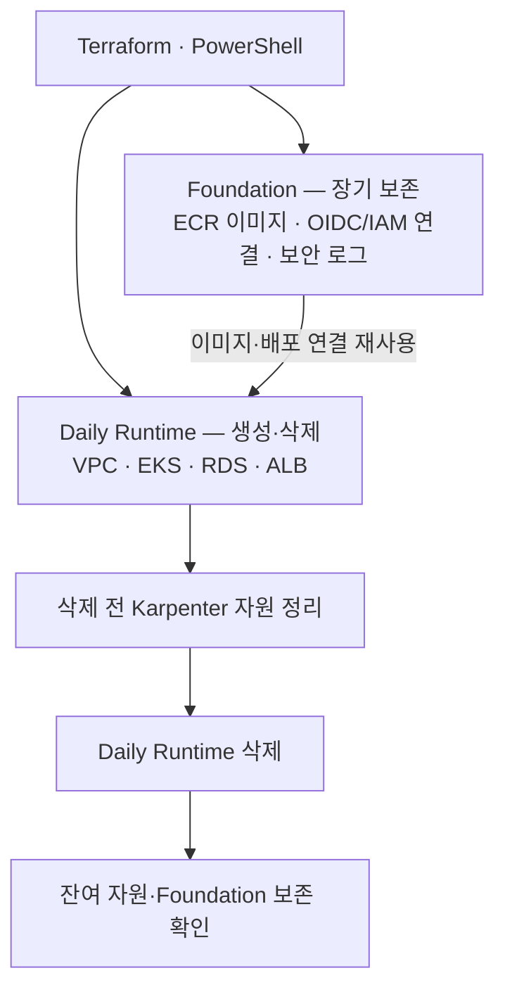
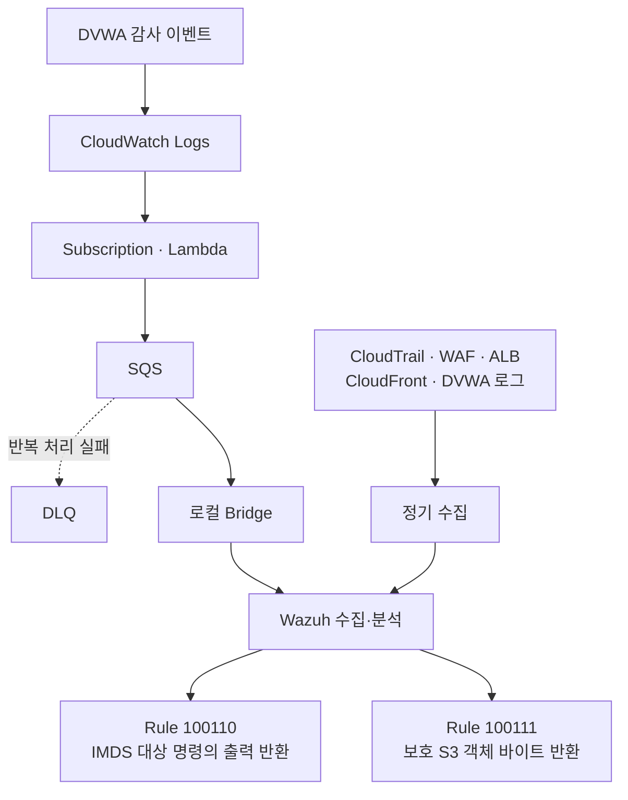
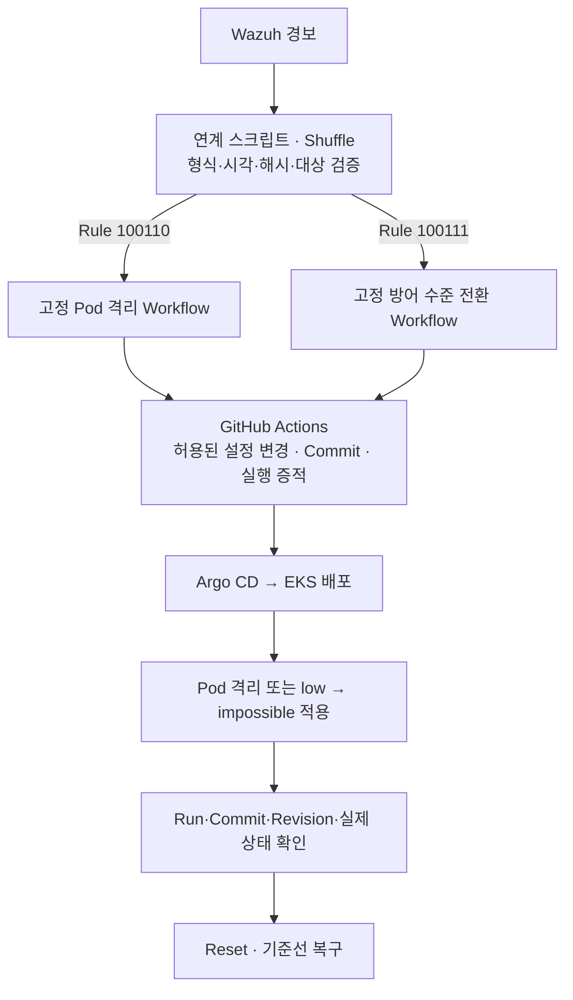

# 입사지원서 장운호 작업본

## 인적사항

| 항목 | 내용 |
|---|---|
| 성명(국문) | 장운호 |
| 성명(영문) | Jang Unho |
| 생년월일 | 2003년 06월 26일 (만 23세) |
| 연락처 | 010-3012-0626 |
| 이메일 | unoh0626@gmail.com |
| 주소 | 인천광역시 서구 서곶로 50 |

## 포트폴리오 및 학습 자료

| 항목 | 내용 |
|---|---|
| GitHub | https://github.com/Unoh03/Obsi3 (각종 학습노트 및 기록 저장소) |
| GitHub | https://github.com/Unoh03/bank-security-lab-infra (최종 프로젝트 테라폼,와주 관련) |

## 병역사항 예시 양식

| 항목 | 내용 |
|---|---|
| 병역구분 | 군필 (예시) |
| 군별 | 육군 (예시) |
| 복무기간 | 0000.00 ~ 0000.00 |

## 자격증 및 면허

| 취득일 | 자격증 및 면허 | 발급기관 |
|---|---|---|
| 2022.02 | 자동자운전면허증 2종 보통 | 도로교통공단 |

## 병역사항 실제 기재

| 항목 | 내용 |
|---|---|
| 병역구분 | 군필 |
| 군별 | 육군 |
| 복무기간 | 2023.08 ~ 2025.02 |

## 학력사항

| 기간 | 학교 | 상태 | 계열 |
|---|---|---|---|
| 2019.03 ~ 2022.02 | 인천고등학교 | 졸업 | 이과계열 |

## 교육 수료사항

| 기간 | 교육기관 | 과정명 | 상태 |
|---|---|---|---|
| 2026.02 ~ 2026.08 | KG에듀원 아이티뱅크 학원 | 보안 위협 대응을 위한 클라우드 기반 보안 엔지니어 양성 과정 | 수료 |

### 활용 가능 기술

| 구분 | 상세 Skill |
|---|---|
| Cloud(AWS) | VPC, EC2, EKS, S3, IAM, ELB, Route53, WAF, CloudWatch, CloudTrail, Security Hub, GuardDuty 등 |
| Kubernetes | EKS, Karpenter, Ingress, PV/PVC, PLG Stack (Prometheus, Loki, Grafana) |
| IAC | Terraform (HCL) |
| GitOps | Git (GitHub, GitLab, Gitea), ArgoCD, Harbor, AWS ECR |
| WEB Programming | Web Application (Spring Boot, PHP), OWASP Top 10 기반 시큐어 코딩 |
| Database | RDBMS (MySQL, MariaDB), NoSQL (Redis), SQL Query |
| Security | 주요정보통신기반시설 기술적 취약점 분석·평가 가이드 기반 취약점 진단, 시스템/네트워크 보안 강화 |
| Network | TCP/IP Networking, Routing, ACL, NAT, VPN |
| Linux / Server | Linux (CentOS/Ubuntu), Web/Proxy Server (Nginx, Apache), DNS, Storage, Shell Scripting |

위의 모든 기재사항은 사실과 다름없음을 확인합니다.

작성자: 장 운 호

# 자기소개서

## 해당 분야에 지원한 본인만의 강점과 장점

저의 강점은 결과가 나왔다는 사실에 만족하지 않고, 그 결과가 실제로 무엇을 증명하는지 다시 확인하는 검증 습관입니다.

최근 교육 과정 AWS 보안 프로젝트에서 Capital One 사고를 기반으로 한 통제된 공격 시나리오를 검증했습니다. Command Injection을 통해 EC2 메타데이터 서비스에 접근하고, 노드 IAM 역할의 임시 자격증명으로 가짜 S3 객체를 조회한 뒤 CloudTrail의 GetObject 이벤트와 탐지 경보 발생을 확인했습니다. 그러나 공격에서 경보가 울렸다는 사실만으로 탐지 조건이 적절하다고 판단하지 않았습니다. 정상 사용자 권한으로 같은 객체를 다시 조회하는 대조 실험을 수행했고, 동일한 GetObject 이벤트가 발생하더라도 공격에 사용된 노드 역할이 아니면 경보가 발생하지 않는 것을 확인했습니다.

이처럼 저는 성공 여부보다 증거가 뒷받침하는 범위를 구분하고, 필요한 경우 대조군과 재검증을 추가합니다. 입사 후에도 취약점 진단과 보안 분석에서 결과를 그대로 받아들이기보다 정탐·오탐과 조치의 근거를 확인해 신뢰할 수 있는 판단으로 연결하겠습니다.

## 관심 있는 분야와 이를 바탕으로 수행 또는 적용한 경험

저는 취약점을 단순히 어떻게 악용하는가보다, 왜 발생하는가의 관점에서 분석하는 데 관심이 있습니다. 사용자 입력이나 권한, 설정이 뒤쪽의 해석기와 시스템에서 어떻게 처리되어 의도하지 않은 동작으로 이어지는지, 그리고 어떤 조치가 그 경로를 실제로 끊는지를 이해하는 것이 중요하다고 생각합니다.

교육 과정 웹 애플리케이션 취약점 프로젝트에서 KISA 가이드를 바탕으로 Injection 계열 취약점을 학습하고 검증했습니다. 기존 애플리케이션에 해당 기능이 없을 때는 결과만 보여주는 얕은 시연을 만들기보다 실제 LDAP 서버나 명령 해석기처럼 취약점이 성립하는 조건이 필요한지 먼저 검토했습니다. SQL Injection에서는 사용자 입력을 SQL 문자열에 직접 결합하면 입력이 데이터가 아니라 SQL 문법으로 해석된다는 원인을 확인하고, Prepared Statement와 허용 목록 방식의 조치를 적용해 같은 입력이 더 이상 SQL 구문으로 해석되지 않는 구조를 비교했습니다.

이 관심은 현재 IAM·IMDS·워크로드 권한처럼 클라우드에서 침해 경로를 만드는 조건과 조치를 분석하는 것으로 확장되고 있습니다. 앞으로도 취약점 이름이나 공격 구문을 나열하기보다 공격이 성립하는 원인과 보안 통제의 작동 원리를 설명하고 검증할 수 있도록 학습을 이어가겠습니다.

> [빨간 작성 메모] 웹 이야기에서 클라우드로 넘어가는 전환이 갑작스러울 수 있으므로, 웹 취약점과 클라우드 침해 경로 간의 연계성 언급

> [파란 대체 문장] 최근에는 이러한 관심을 웹을 넘어 클라우드 환경의 IAM·IMDS·워크로드 권한으로 확장하고 있습니다. 웹 애플리케이션의 입력값 검증 미흡이 클라우드 인프라에서는 IAM 권한 남용 및 침해 경로 형성으로 이어지는 과정을 분석하고 있습니다. 앞으로도 공격 구문 나열을 넘어, 침해 원인과 보안 통제의 작동 원리를 명확히 설명하고 검증하는 보안 엔지니어로 성장하겠습니다.

## 해당 분야에 지원하기 위해 습득한 지식과 기술

클라우드 보안 프로젝트에서 AWS 실습 환경의 비용을 통제하면서 반복 사용할 수 있도록 Terraform 기반 수명주기 자동화를 적용했습니다. 전체 환경을 매일 삭제하면 VPC·EKS·RDS 같은 비용성 자원뿐 아니라 ECR 이미지, GitHub OIDC·IAM 연결, GitOps 구성과 보안 로그까지 사라지는 문제가 있었습니다. 이에 장기 보존이 필요한 Foundation과 매일 생성·삭제할 Daily Runtime을 별도의 Terraform Root와 State로 분리했습니다. 실제 AWS에서 EKS·RDS·Argo CD와 애플리케이션을 재생성하고, 삭제 후 Daily State와 활성 Runtime이 남지 않으면서 Foundation이 유지되는 것을 검증했습니다.

이후 Karpenter가 동적으로 만든 NodeClaim과 EC2가 Terraform State 밖에 남아 Daily Down이 실패했습니다. EKS와 Karpenter Controller가 먼저 제거되면서 고아 EC2가 네트워크 자원 삭제를 막은 것이 원인이었습니다. 잔여 자원을 복구해 Runtime 0을 확인한 뒤, Terraform Destroy 전에 NodePool·NodeClaim을 정리하고 EC2 종료를 제한 시간 동안 확인하도록 절차를 보완했습니다. 또한 범위 밖 자원을 삭제하지 않도록 여러 태그 조건을 적용하고, 실패 원인을 추적할 수 있도록 진단 로그를 추가해 정적 테스트를 통과시켰습니다.

이 경험을 통해 IaC의 선언 상태와 실제 Runtime 자원의 소유권이 항상 일치하지 않는다는 점과 자동화에서는 성공 경로뿐 아니라 실패·복구 경계까지 설계해야 한다는 점을 배웠습니다. 입사 후에도 자동화 결과를 실제 환경과 대조하며 안정적인 클라우드 운영과 보안 개선에 기여하겠습니다.

> [빨간 작성 메모] 질문 의도에 맞는 답변으로 나타내기 위해 서론에 [습득한 기술 스택 요약]을 한 줄 추가

> [파란 추가 문장] 클라우드 보안 및 운영 효율화를 위해 AWS, Kubernetes(EKS), Terraform(IaC) 및 GitOps 환경 구축 지식을 습득했으며, 이를 바탕으로 보안 실습 환경의 수명주기 자동화를 구현했습니다.

## 지원동기 및 입사 후 이루고 싶은 포부

보안 직무에 지원하려는 이유는 공격 기법 자체보다, 공격이나 취약한 동작이 왜 가능했는지 원인을 찾고 그에 맞는 조치를 적용해 결과가 달라지는 과정을 알아가는 데 가장 큰 흥미를 느꼈기 때문입니다. 웹 취약점 실습에서는 입력값이 해석기까지 전달되는 구조를 따라가며 취약점의 원인을 공부했고, 클라우드 프로젝트에서는 IAM·IMDS·워크로드 권한과 로그까지 범위를 넓혀 침해 경로와 보안 통제의 반응을 확인했습니다. 프로젝트가 탐지 단계까지 발전한 뒤에도 제가 가장 궁금했던 것은 경보 자체보다 그 다음에 어떤 근거로 대응하고, 어떤 조치가 원인을 제거하는가였습니다. 실제 멘토 상담에서도 대응 런북과 자동 대응을 어느 범위까지 구현하는 것이 현실적인지 질문하며 관심을 구체화했습니다.

저는 취약점과 침해 현상의 원인을 분석하고, 적절한 조치를 설계한 뒤 재검증까지 연결할 수 있는 보안 엔지니어를 목표로 하고 있습니다. 입사 초기에는 담당 시스템의 구조와 정상 흐름, 로그, 보안 정책과 기존 대응 절차를 정확히 익히겠습니다. 이후 업무에서 접한 취약점과 사고 사례를 복기하며 원인과 조치의 관계를 제 지식으로 축적하고, AWS·Kubernetes·IAM 등 클라우드 보안 기술도 지속적으로 심화하겠습니다. 장기적으로는 현상을 설명하는 데 그치지 않고 근본 원인에 맞는 대응 방안을 제시하고 그 효과까지 검증할 수 있는 엔지니어로 성장하겠습니다.

# 프로젝트

## 프로젝트 기본정보

| 항목 | 주요내용 |
|---|---|
| 프로젝트명 | 퍼블릭 클라우드 기반 보안 운영 (AWS·EKS 통합 보안관제 및 자동 대응 구현) |
| 수행기간 | 2026.07.28 ~ 2026.08.28 |
| 인원 | 4명 |

### 서비스 목표

1. AWS·EKS의 분산 로그를 수집·분석하는 통합 보안관제 환경 구축
2. Wazuh 탐지 규칙으로 웹 공격과 클라우드 권한 오용을 단계별 탐지
3. 검증된 경보를 Shuffle·GitHub Actions·Argo CD 기반 자동 대응과 추적·복구로 연결

### 개발환경 및 사용기술

| 구분 | 내용 |
|---|---|
| Cloud / Architecture | AWS (VPC, EKS, EC2, S3, IAM, CloudFront, WAF), Kubernetes |
| CI/CD | GitHub Actions, Amazon ECR, Argo CD, GitOps |
| IaC | Terraform (HCL) |
| Database | Amazon RDS (MariaDB) |
| Backend | PHP, DVWA |
| Observability | Wazuh, Shuffle, CloudWatch, CloudTrail, Grafana, Loki, Prometheus, Fluent Bit |
| Frontend | React, Vite |

## 주요역할 및 구현기능

### 주요역할 설계

- AWS·EKS 기반 보안 실습환경을 구축하고, Terraform으로 인프라 생성·삭제와 재구축 절차 설계
- ECR 이미지·IAM 연결·보안 로그를 보존하는 Foundation과 매일 생성·삭제하는 Daily Runtime의 수명주기 분리
- AWS·애플리케이션 로그의 정기 수집과 DVWA 이벤트의 저지연 전달을 결합한 Wazuh 관제 구조 설계
- IMDS 접근과 S3 객체 조회를 서로 다른 공격 단계로 구분하고, 단계별 탐지 조건과 대응 범위 설계
- Wazuh·Shuffle에서 경보를 검증한 뒤 사전 정의된 GitHub Actions·Argo CD 작업으로 연결하는 자동 대응 및 복구 절차 설계

### 구현기능 서비스

- Terraform과 PowerShell 기반 Daily Up·Down 자동화 및 삭제 전 Karpenter NodeClaim·EC2 정리 기능 구현
- CloudWatch Logs → Lambda → SQS → 로컬 Bridge를 통해 DVWA 이벤트를 Wazuh로 전달하는 경로 구현
- Wazuh Rule `100110`으로 IMDS 자격증명 엔드포인트 대상 명령의 출력 반환을, Rule `100111`로 지정 노드 역할의 보호 S3 객체 바이트 반환을 구분해 탐지하도록 구현
- 경보의 형식·발생 시각·해시·대상을 검증하고 허용된 Workflow만 실행하는 Wazuh–Shuffle 연계 기능 구현
- 공격 대상 Pod의 UID와 소유 관계를 재확인한 뒤, 해당 Pod를 보존하면서 NetworkPolicy로 통신을 차단하는 격리 기능 구현
- DVWA의 방어 수준을 `low → impossible`로 전환하고, Git Commit·Argo CD 배포 이력과 Reset 절차로 변경을 추적·복구하도록 구현

## 프로젝트 참여소감

프로젝트를 진행하며 보안관제는 경보를 만드는 것에서 끝나지 않고, 그 경보가 무엇을 증명하며 어디까지 조치할 수 있는지 판단하는 과정이라는 점을 배웠습니다. 같은 S3 객체에 대한 공격 역할과 정상 운영자의 접근을 비교하면서 로그 수집과 탐지 조건을 구분했고, 이후 관제에서는 IMDS 관련 신호와 실제 객체 바이트 반환을 서로 다른 단계의 근거로 다루었습니다. 자동 대응 역시 대상과 실행 범위를 제한하고 변경 이력과 복구 절차를 함께 갖추는 데 중점을 두었습니다.

운영 측면에서는 매일 재생성할 자원과 보존할 자원을 분리하고, Terraform State 밖에 남는 Karpenter 자원의 정리 절차를 보완했습니다. 이 경험을 통해 선언한 구성과 실제 환경을 대조하는 습관, 성공뿐 아니라 실패와 복구까지 고려하는 태도의 중요성을 익혔습니다. 앞으로도 구현 여부에 그치지 않고 실제 동작과 조치 효과를 근거로 설명할 수 있는 보안 엔지니어로 성장하고자 합니다.

## 인프라 아키텍처 설계 1

### 구성 및 구현 항목명

Terraform 기반 AWS·EKS 보안 실습환경과 수명주기 자동화

### 이미지

### 구성항목 설명

1. **실습환경 구성:** AWS 네트워크와 EKS·RDS MariaDB·ALB 등을 Terraform으로 관리하고, EKS에 DVWA를 배포해 공격·탐지·조치 실습의 기반을 마련했습니다.
2. **수명주기 분리:** 이미지 저장소, GitHub OIDC·IAM 연결, 보안 로그는 Foundation에 두고, 매일 사용하는 Runtime과 Terraform Root·State를 분리했습니다. 반복 실습 비용을 통제하면서 재구축에 필요한 기반을 유지하기 위한 구성입니다.
3. **생성·삭제 자동화:** PowerShell 스크립트에 계획 확인, 환경 생성·삭제, 결과 확인 절차를 구성해 반복 작업의 누락을 줄이도록 했습니다.
4. **잔여 자원 대응:** Terraform이 직접 관리하지 않는 Karpenter 자원이 삭제를 방해하는 문제에 대응해 NodeClaim·EC2를 먼저 정리하고, 태그 조건과 제한 시간으로 정리 범위를 통제했습니다.

## 인프라 아키텍처 설계 2

### 구성 및 구현 항목명

AWS 로그 수집과 Wazuh 기반 단계별 공격 탐지

### 이미지

### 구성항목 설명

1. **두 수집 경로의 역할 분담:** 여러 AWS 로그를 정기적으로 수집하는 경로를 유지하고, 초기 대응 판단에 사용할 DVWA 이벤트에는 별도의 저지연 전달 경로를 추가했습니다.
2. **DVWA 이벤트 전달:** CloudWatch Logs Subscription, Lambda, SQS와 로컬 Bridge를 연결해 이벤트를 Wazuh 분석 입력으로 전달했습니다. SQS와 DLQ를 구성해 전달 대기와 실패 메시지를 다룰 수 있도록 했습니다.
3. **단계별 탐지 조건:** Rule `100110`은 DVWA에서 IMDS 자격증명 엔드포인트를 대상으로 실행한 명령의 출력 반환을 탐지합니다. Rule `100111`은 지정 역할·객체·HTTP 200·양수 반환 바이트 등의 조건으로 보호 S3 객체의 실제 데이터 반환을 식별합니다.
4. **분석 기준:** 두 경보가 나타내는 사실을 구분하고, 원본 이벤트·역할·객체·시각을 비교해 공격 흐름을 해석하도록 했습니다. 초기 신호만으로 공격 전체의 성공이나 조기 차단을 단정하지 않는 구조입니다.

## 인프라 아키텍처 설계 3

### 구성 및 구현 항목명

Shuffle·GitOps 기반 제한된 자동 대응과 추적·복구

### 이미지

### 구성항목 설명

1. **경보 검증:** Wazuh 연계 스크립트와 Shuffle에서 경보의 형식·발생 시각·해시·대상을 확인하고, 사전에 정한 Workflow로만 대응 요청을 전달하도록 구성했습니다.
2. **침해 Pod 격리·보존:** Rule `100110`에 연결된 작업은 대상 Pod의 UID와 소유 관계를 확인한 뒤, Pod를 조사 대상으로 보존하면서 격리 Label과 NetworkPolicy로 인바운드·아웃바운드 통신을 차단하도록 구현했습니다.
3. **방어 수준 전환:** Rule `100111`에 연결된 작업은 허용된 설정 파일의 DVWA 방어 수준을 `low → impossible`로 변경하고 Argo CD가 배포하도록 구성했습니다. DVWA에 사전 구현된 방어 기능을 적용하는 방식입니다.
4. **추적과 복구:** GitHub Actions Run, Git Commit, Argo CD Revision과 실제 Pod·애플리케이션 상태를 확인 대상으로 두었습니다. 격리와 방어 수준을 되돌리는 Reset 절차를 마련해 같은 조건의 재검증으로 이어지도록 했습니다.
