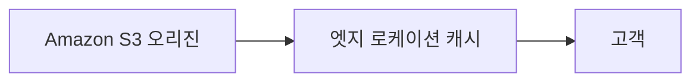
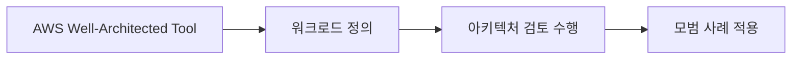
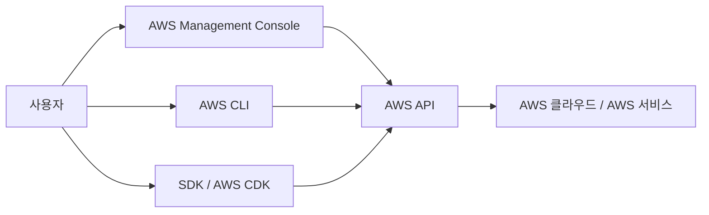

# Architecting on AWS - 모듈 1 아키텍팅 기본 사항 Source Digest

> [!note]
> 이 노트는 학습용 개념 노트로 재구성하기 전, PDF의 페이지별 정보를 보존하기 위한 Source Digest이다.  
> 반복되는 인쇄자 워터마크와 저작권 문구는 각 페이지마다 반복하지 않고 메타 정보로만 취급한다.

## 한 줄 요약

모듈 1은 AWS 서비스를 단순 소개하는 단원이 아니라, **비즈니스 요구를 AWS 인프라 구성과 Well-Architected Framework 기반의 설계 판단으로 연결하는 입문 모듈**이다.

---

## p.27 / 파일 p.1 - 모듈 표지

### 슬라이드 핵심

- 과정: `Architecting on AWS`
- 모듈: `모듈 1: 아키텍팅 기본 사항`
- 포함 실습: `실습 1`

### Source Digest 처리

이 페이지는 본문 개념 설명보다는 모듈 시작을 알리는 표지다.

### 이미지/도식 처리

- 유형: 표지 이미지
- 처리: 이미지 생략
- 보존 내용:
  - 모듈명
  - 실습 포함 여부

### 분리 후보

- 없음

---

## p.28 / 파일 p.2 - 확인 질문

### 슬라이드 핵심

질문:

> 조직에서 AWS 클라우드로 이전하는 과정을 어느 정도 진행했습니까?

선택지:

| 보기 | 내용 |
|---|---|
| A | 이전 과정 시작 단계 |
| B | 이미 프로토타입 실행 중 |
| C | 프로덕션 워크로드를 실행하고 있음 |
| D | AWS Cloud에서 모든 운영 작업 실행 중 |

### Source Digest 처리

이 페이지는 학습자의 현재 AWS 도입 수준을 점검하기 위한 사전 확인 질문이다.

### 학습상 의미

이 질문은 모듈 1의 출발점이 “AWS 서비스 암기”가 아니라 **조직의 클라우드 도입 단계에 따라 아키텍처 판단이 달라진다**는 점을 암시한다.

### 이미지/도식 처리

- 유형: 확인 질문 슬라이드
- 처리: 문제와 선택지만 텍스트로 보존
- 이미지 원본 보존 필요성: 낮음

### 분리 후보

- `Appendix - 모듈 1 지식 확인`
- 단, 이 질문은 정식 지식 확인 문제라기보다 모듈 도입용 질문이므로 본문 도입부에 남겨도 된다.

---

## p.29 / 파일 p.3 - 모듈 개요

### 슬라이드 핵심

모듈 1의 구성은 다음과 같다.

- 기업 요청 사항
- `Amazon Web Services(AWS)` 서비스
- AWS 인프라
- `AWS Well-Architected Framework`
- 솔루션 제시
- 지식 확인
- 실습 1: `AWS 관리 콘솔` 및 `AWS Command Line Interface` 살펴보기 및 상호작용

### Source Digest 처리

이 페이지는 모듈 전체 구조를 제시하는 목차 페이지다.  
이후 Source Digest의 큰 섹션 구성 기준으로 사용한다.

### 모듈 흐름 해석

이 모듈은 다음 흐름으로 진행된다.

```text
기업 요청 사항
→ AWS 서비스 사용 이점
→ AWS 글로벌 인프라 구성
→ Well-Architected Framework 기반 검토
→ 솔루션 제시
→ 지식 확인
→ Console / CLI 실습
````

### 이미지/도식 처리

- 유형: 단순 목차 슬라이드
    
- 처리: Markdown 목록으로 변환
    
- 이미지 원본 보존 필요성: 낮음
    

### 분리 후보

- 없음
    
- 단, 이 페이지의 목차는 전체 Source Digest 구조의 기준으로 사용한다.
    

---

## p.30 / 파일 p.4 - 비즈니스 요청 사항

### 슬라이드 핵심

Chief Technology Officer, 즉 CTO가 다음 사항의 검토를 요청한다.

- AWS 서비스를 사용하면 어떤 이점이 있는가?
    
- AWS 글로벌 인프라는 어떻게 구성되어 있는가?
    
- 모범 사례에 따라 클라우드 인프라를 구축하는 방법은 무엇인가?
    

### 하단 설명문 핵심

프로젝트 회의에서 CTO와 회의를 진행한다.  
CTO는 AWS 관련 사항을 숙지하면서, 조직에서 AWS 구축을 준비할 때 고려해야 할 질문을 제시한다.  
이 모듈에서는 해당 질문에 답할 수 있는 주제를 다룬다.

### Source Digest 처리

이 페이지는 모듈 1의 핵심 문제 제기다.  
이후 모든 내용은 위 세 질문에 답하기 위한 구조로 해석해야 한다.

### 학습상 의미

모듈 1의 중심 질문은 다음과 같이 압축된다.

```text
AWS를 왜 쓰는가?
AWS 인프라는 어떤 단위로 구성되는가?
좋은 AWS 아키텍처는 어떤 기준으로 판단하는가?
```

따라서 이 모듈은 단순 서비스 목록이 아니라 **아키텍처 판단 프레임**을 소개하는 단원이다.

### 이미지/도식 처리

- 유형: 인물 아이콘 + 질문 목록
    
- 처리: 질문 목록만 텍스트로 보존
    
- 이미지 원본 보존 필요성: 낮음
    

### 분리 후보

- `Concept - AWS 아키텍처 판단 프레임`
    
- 다만 1차 Source Digest에서는 본문 도입부에 보존한다.
    

---

## p.31 / 파일 p.5 - AWS 서비스 섹션 표지

### 슬라이드 핵심

섹션 제목:

- AWS 서비스
    

핵심 질문:

> AWS 서비스 사용 시의 이점은 무엇인가?

### 하단 설명문 핵심

프로젝트 회의에서 CTO는 “AWS 서비스를 사용하면 어떤 이점이 있는가?”라고 질문했다.  
이 섹션에서는 비즈니스 요구를 충족하는 AWS 서비스와 도구를 파악한다.

### Source Digest 처리

이 페이지는 `AWS 서비스` 파트의 시작을 알리는 섹션 마커다.

### 다음 내용과의 연결

이후 페이지에서는 다음을 다룬다.

- AWS 서비스의 기본 특징
    
- AWS로 이전하는 이유
    
- AWS 서비스 범주
    

### 이미지/도식 처리

- 유형: 섹션 표지
    
- 처리: 제목과 핵심 질문만 보존
    
- 이미지 원본 보존 필요성: 낮음
    

### 분리 후보

- `Concept - AWS 서비스와 클라우드 이전 이유`
    

---

## 현재 블록 Coverage Check

|파일 p.|교재 p.|반영 상태|비고|
|--:|--:|---|---|
|1|27|preserved|모듈 표지로 보존|
|2|28|preserved|도입 확인 질문으로 보존|
|3|29|preserved|모듈 구조 기준으로 보존|
|4|30|preserved|CTO 비즈니스 요청으로 보존|
|5|31|preserved|AWS 서비스 섹션 시작으로 보존|

## 현재까지 분리 후보

|후보|근거 페이지|판단|
|---|--:|---|
|`Concept - AWS 아키텍처 판단 프레임`|p.30|모듈 전체 관통 주제|
|`Concept - AWS 서비스와 클라우드 이전 이유`|p.31~34 예정|다음 블록에서 본격화|
|`Appendix - 모듈 1 도입 확인 질문`|p.28|필요 시 지식 확인과 별도 관리|

---

## p.32 / 파일 p.6 - Amazon Web Services

### 슬라이드 핵심

`Amazon Web Services(AWS)`는 전 세계 고객에게 클라우드 기반 서비스를 제공하는 플랫폼으로 소개된다.

슬라이드에서 제시하는 AWS의 특징은 다음과 같다.

- 글로벌 데이터 센터
- 200개 이상의 서비스
- 보안 및 안정성
- 종량제
- 비즈니스 요구 사항에 따라 구축

### 하단 설명문 핵심

AWS는 전 세계에서 채택률이 높은 포괄적인 클라우드 솔루션으로 설명된다.  
주요 제공 영역은 다음과 같다.

- 컴퓨팅
- 데이터베이스
- 스토리지

AWS는 중앙집중형 모델에 의존하지 않고, 보안 사례를 제공하며, 기업과 공공 기관이 선택하는 기본 클라우드 솔루션으로 제시된다.

또한 AWS는 전 세계 고객을 대상으로 클라우드 서비스를 제공해 왔고, 다음 특성을 강조한다.

- 운영 경험
- 대규모 인프라
- 신뢰성
- 성능
- 보안 기록

다양한 규모의 고객은 다음 목적을 위해 AWS를 사용한다.

- 비용 절감
- 민첩성 향상
- 혁신 가속화

AWS는 업무 방식을 개선하는 데 사용할 수 있는 신기술 개발을 위해 지속적으로 혁신에 투자한다고 설명된다.

### Source Digest 처리

이 페이지는 AWS를 “단일 서비스”가 아니라 **여러 클라우드 서비스와 글로벌 인프라를 제공하는 플랫폼**으로 소개한다.

### 학습상 의미

여기서 중요한 포인트는 AWS를 단순히 “서버 빌려주는 곳”으로 보면 안 된다는 것이다.

```text
AWS = 글로벌 인프라 + 다양한 관리형 서비스 + 종량제 모델 + 보안/안정성 기반의 클라우드 플랫폼
````

이 관점이 이후 `AWS 인프라`, `Well-Architected Framework`, `실습 1`로 이어진다.

### 이미지/도식 처리

- 유형: 세계 지도 + 특징 bullet
    
- 처리: 지도 이미지는 생략 가능
    
- 보존 내용:
    
    - 글로벌 인프라를 가진 클라우드 플랫폼이라는 의미
        
    - 200개 이상의 서비스
        
    - 종량제
        
    - 보안 및 안정성
        
    - 비즈니스 요구사항 기반 구축
        

### 분리 후보

- `Concept - AWS 서비스와 클라우드 이전 이유`
    

---

## p.33 / 파일 p.7 - 고객이 AWS로 이전하는 이유

### 슬라이드 핵심

고객이 AWS로 이전하는 주된 이유는 **민첩성 개선**으로 제시된다.

슬라이드 도식은 다음 두 축으로 구성된다.

|방향|의미|관련 항목|
|---|---|---|
|위쪽 화살표|민첩성 향상|출시 시간 단축, 더 광범위한 혁신 추진, 필요에 따른 크기 조정|
|아래쪽 화살표|복잡함 및 위험 감소|비용 최적화, 보안 취약성 최소화, 복잡한 관리 작업 감소|

### 하단 설명문 핵심

AWS로 이전하는 주요 이유는 다음과 같다.

#### 민첩성 개선

- **출시 시간 단축**
    
    - 인프라 확보 및 관리 시간이 줄어든다.
        
    - 고객에게 가치를 제공하는 기능 개발에 더 집중할 수 있다.
        
- **더욱 광범위한 혁신 추진**
    
    - 디지털 트랜스포메이션을 더 빠르게 추진할 수 있다.
        
    - 최신 기술과 모범 사례를 더 쉽게 활용할 수 있다.
        
    - 예시:
        
        - 자동화 기능 개발
            
        - 컨테이너화 채택
            
        - 기계 학습 사용
            
- **원활한 크기 조정**
    
    - 추가 리소스를 프로비저닝할 수 있다.
        
    - 수요에 따라 기존 리소스를 확장하거나 축소할 수 있다.
        

#### 복잡한 작업과 위험 감소

- **비용 최적화**
    
    - 사용한 만큼 비용을 지불한다.
        
    - 온프레미스 하드웨어 비용 대신 컴퓨팅 리소스 사용 시간에 따른 비용 구조를 사용할 수 있다.
        
- **보안 취약성 최소화**
    
    - 애플리케이션과 데이터가 AWS 데이터 센터의 물리적 보안 기능으로 보호될 수 있다.
        
    - AWS의 도구를 사용해 리소스 액세스를 관리할 수 있다.
        
- **복잡한 관리 작업 감소**
    
    - 물리적 데이터 센터 유지 관리가 줄어든다.
        
    - 하드웨어 유지 관리와 물리적 인프라 관리 작업의 필요성을 줄일 수 있다.
        

### 참고 링크

```text
https://aws.amazon.com/campaigns/migrating-to-the-cloud/
```

### Source Digest 처리

이 페이지는 “AWS를 왜 쓰는가?”에 대한 직접 답변이다.  
모듈 1의 CTO 질문 중 첫 번째 질문인 **“AWS 서비스를 사용하면 어떤 이점이 있는가?”**에 대응한다.

### 학습상 의미

AWS 이전 이유를 단순히 “싸고 편해서”로 줄이면 안 된다.  
PDF의 논리는 다음에 가깝다.

```text
AWS 이전 이유
= 민첩성 향상
+ 혁신 속도 증가
+ 수요 기반 확장/축소
+ 비용 구조 최적화
+ 보안 및 접근 관리 개선
+ 물리 인프라 관리 부담 감소
```

### 이미지/도식 처리

- 유형: 민첩성 향상 / 복잡함 및 위험 감소 도식
    
- 처리: 원본 이미지 생략 가능
    
- 보존 방식:
    
    - 위쪽/아래쪽 화살표 구조를 표로 변환
        
    - 6개 이유를 bullet로 보존
        

### 분리 후보

- `Concept - AWS 서비스와 클라우드 이전 이유`
    

---

## p.34 / 파일 p.8 - AWS 서비스 범주

### 슬라이드 핵심

AWS는 광범위한 글로벌 클라우드 기반 제품 세트를 제공한다.

슬라이드에는 여러 AWS 서비스 범주가 표시되어 있으며, 이 교육 과정에서 강조하는 범주는 다음과 같다.

|강조 범주|원문 표기|
|---|---|
|서버리스|서버리스|
|네트워킹 및 콘텐츠 전송|네트워킹 및 콘텐츠 전송|
|데이터베이스|데이터베이스|
|보안, 자격 증명 및 규정 준수|보안, 자격 증명 및 규정 준수|
|관리 및 거버넌스|관리 및 거버넌스|
|스토리지|스토리지|
|AWS 비용 관리|AWS 비용 관리|
|컴퓨팅|컴퓨팅|
|컨테이너|컨테이너|

슬라이드에는 그 외에도 다음과 같은 범주가 회색 아이콘으로 함께 표시된다.

- 분석
    
- 고객 지원
    
- 개발자 도구
    
- 고객 참여
    
- 비즈니스 애플리케이션
    
- 애플리케이션 통합
    
- 마이그레이션 및 이전
    
- 최종 사용자 컴퓨팅
    
- 기계 학습
    
- 게임 개발
    
- 인공위성
    
- 프런트 엔드 웹 및 모바일
    
- 로보틱스
    
- VR 및 AR
    
- 사물 인터넷(IoT)
    
- 미디어 서비스
    
- 블록체인
    
- 양자 기술
    

### 하단 설명문 핵심

AWS는 컴퓨팅, 스토리지, 데이터베이스, 분석, 네트워킹, 모바일, 개발자 도구, 관리 도구, 사물 인터넷, 보안 및 엔터프라이즈 애플리케이션 등을 포함한 클라우드 기반 제품 세트를 제공한다.

이러한 서비스는 조직이 다음을 수행하는 데 사용될 수 있다.

- 더 빠르게 이동
    
- 확장
    
- IT 비용 절감
    

이 과정에서는 슬라이드에서 강조 표시된 AWS 서비스 범주를 중점적으로 살펴본다.

### 참고 링크

```text
https://aws.amazon.com/products/
```

### Source Digest 처리

이 페이지는 이후 모듈들의 큰 범주 지도를 제공한다.  
모듈 1에서 모든 서비스를 깊게 설명하는 것이 아니라, 전체 과정에서 다룰 주요 서비스 영역을 보여주는 역할이다.

### 학습상 의미

여기서 중요한 것은 개별 서비스명을 외우는 것이 아니라, AWS 서비스를 **아키텍처 구성 요소의 범주**로 보는 것이다.

```text
컴퓨팅 / 네트워킹 / 스토리지 / 데이터베이스 / 보안 / 관리 / 비용 / 컨테이너 / 서버리스
```

이 범주들이 이후 모듈 2~13의 큰 흐름으로 연결된다.

### 이미지/도식 처리

- 유형: AWS 서비스 범주 아이콘 그리드
    
- 처리: 원본 이미지 생략 가능
    
- 보존 방식:
    
    - 강조된 범주는 표로 보존
        
    - 회색 처리된 기타 범주는 목록으로 보존
        
- 이미지 원본 보존 필요성: 낮음
    

### 분리 후보

- `Concept - AWS 서비스와 클라우드 이전 이유`
    
- `MOC - Architecting on AWS 전체 서비스 범주`
    

---

## 현재 블록 Coverage Check

|파일 p.|교재 p.|반영 상태|비고|
|--:|--:|---|---|
|6|32|preserved|AWS의 기본 성격과 특징 보존|
|7|33|preserved|AWS 이전 이유 6개 항목 보존|
|8|34|preserved|강조된 AWS 서비스 범주와 기타 범주 보존|

## 현재까지 누적 분리 후보

|후보|근거 페이지|판단|
|---|--:|---|
|`Concept - AWS 아키텍처 판단 프레임`|p.30|모듈 전체 관통 주제|
|`Concept - AWS 서비스와 클라우드 이전 이유`|p.31~34|AWS의 이점과 이전 이유 정리|
|`MOC - Architecting on AWS 전체 서비스 범주`|p.34|전체 과정의 서비스 범주 지도 후보|
|`Appendix - 모듈 1 도입 확인 질문`|p.28|필요 시 지식 확인과 별도 관리|

## p.35 / 파일 p.9 - AWS 인프라 섹션 표지

### 슬라이드 핵심

섹션 제목:

- AWS 인프라

핵심 질문:

> AWS 글로벌 인프라의 구성 방식

### 하단 설명문 핵심

프로젝트 회의에서 CTO가 다음 질문을 제시했다.

> AWS 글로벌 인프라는 어떻게 구성되어 있습니까?

이 섹션에서는 AWS 인프라를 살펴본다.

### Source Digest 처리

이 페이지는 `AWS 인프라` 파트의 시작을 알리는 섹션 마커다.

### 다음 내용과의 연결

이후 페이지에서는 AWS 글로벌 인프라를 다음 단위로 나누어 설명한다.

- 데이터 센터
- 가용 영역
- 리전
- AWS Local Zones
- 엣지 로케이션

### 이미지/도식 처리

- 유형: 섹션 표지
- 처리: 제목과 핵심 질문만 보존
- 이미지 원본 보존 필요성: 낮음

### 분리 후보

- `Concept - AWS 글로벌 인프라`

---

## p.36 / 파일 p.10 - AWS 인프라 관련 주제

### 슬라이드 핵심

AWS 인프라 관련 주제는 다음 다섯 가지로 제시된다.

- 데이터 센터
- 가용 영역
- 리전
- AWS Local Zones
- 엣지 로케이션

### Source Digest 처리

이 페이지는 AWS 글로벌 인프라의 주요 구성 단위를 나열한다.  
이후 설명의 목차 역할을 한다.

### 학습상 의미

AWS 글로벌 인프라는 단일 계층이 아니라 여러 배치 단위로 구성된다.

```text id="whdgis"
AWS 글로벌 인프라
├─ 데이터 센터
├─ 가용 영역
├─ 리전
├─ AWS Local Zones
└─ 엣지 로케이션
````

단, 이 목록을 단순한 상하위 포함 관계로만 보면 안 된다.  
`데이터 센터`, `가용 영역`, `리전`은 리소스 배치와 고가용성 설계의 기본 단위이고, `AWS Local Zones`와 `엣지 로케이션`은 사용자 근접성, 지연 시간, 콘텐츠 전달 요구와 연결된다.

### 이미지/도식 처리

- 유형: 인프라 주제 목록 도식
    
- 처리: 텍스트 계층 구조로 변환
    
- 이미지 원본 보존 필요성: 낮음
    

### 분리 후보

- `Concept - AWS 글로벌 인프라`
    

---

## p.37 / 파일 p.11 - AWS 데이터 센터

### 슬라이드 핵심

`AWS 데이터 센터`에 대한 핵심 설명은 다음과 같다.

- AWS 서비스는 AWS 데이터 센터 안에서 작동한다.
    
- 데이터 센터는 수천 대의 서버를 호스트한다.
    
- 각 로케이션에서는 AWS 전용 네트워킹 장비를 사용한다.
    
- 데이터 센터는 가용 영역으로 구성된다.
    

### 하단 설명문 핵심

AWS는 빠르고 안전한 인프라 제공을 위해 2006년에 클라우드 컴퓨팅을 시작했다.

AWS는 데이터 센터의 설계와 시스템을 지속적으로 혁신하여 자연 재해나 인재로부터 인프라를 보호한다.  
오늘날 AWS는 전 세계에서 가장 대규모로 데이터 센터를 제공하고 있다고 설명된다.

AWS는 다음을 통해 보안과 규정 준수를 확인한다고 설명한다.

- 제어 구현
    
- 자동화 시스템 구축
    
- 서드 파티 감사 수행
    

또한 가장 규제가 심한 조직들도 매일 AWS를 신뢰한다고 설명한다.

### 참고 링크

```text
https://aws.amazon.com/compliance/data-center/data-centers/
```

### Source Digest 처리

이 페이지는 AWS 글로벌 인프라의 가장 물리적인 기반 단위인 **데이터 센터**를 설명한다.

### 학습상 의미

데이터 센터는 사용자가 보통 직접 선택하는 논리 단위라기보다, AWS 서비스가 실제로 실행되는 물리적 기반이다.

```text
AWS 서비스
→ AWS 데이터 센터에서 작동
→ 데이터 센터들은 가용 영역을 구성
→ 가용 영역들은 리전을 구성
```

따라서 학습 포인트는 “데이터 센터 자체”보다 **데이터 센터가 가용 영역과 리전의 기반이 된다**는 관계다.

### 이미지/도식 처리

- 유형: 데이터 센터 건물/서버/보안 아이콘
    
- 처리: 텍스트 설명으로 대체
    
- 이미지 원본 보존 필요성: 낮음
    

### 분리 후보

- `Concept - AWS 글로벌 인프라`
    

---

## p.38 / 파일 p.12 - 가용 영역

### 슬라이드 핵심

`가용 영역(Availability Zone, AZ)`은 다음처럼 설명된다.

- 리전 내 데이터 센터
    
- 내결함성을 갖도록 설계됨
    
- 고속 프라이빗 링크를 사용하여 상호 연결됨
    
- 고가용성 구성에 사용됨
    

### 하단 설명문 핵심

하나 이상의 데이터 센터 그룹을 **가용 영역**이라고 한다.

가용 영역은 AWS 리전 안에서 다음을 갖춘 하나 이상의 개별 데이터 센터다.

- 중복 전력
    
- 네트워킹
    
- 연결 기능
    

인스턴스를 실행할 때 직접 가용 영역을 선택하거나, AWS가 대신 가용 영역을 선택하도록 할 수 있다.

여러 가용 영역에 인스턴스를 배포하면, 하나의 인스턴스 또는 하나의 가용 영역에 장애가 발생해도 다른 가용 영역의 인스턴스가 요청을 처리할 수 있도록 애플리케이션을 설계할 수 있다.

### 참고 링크

```text
https://aws.amazon.com/about-aws/global-infrastructure/
```

### Source Digest 처리

이 페이지는 AWS 고가용성 설계의 핵심 단위인 **가용 영역**을 설명한다.

### 학습상 의미

가용 영역은 단순한 “서버 위치”가 아니라, 장애 격리를 전제로 한 배치 단위다.

```text
가용 영역의 의미
= 리전 내부의 독립적인 데이터 센터 그룹
+ 중복 전력/네트워크/연결
+ 고속 프라이빗 링크 연결
+ 고가용성 배치 단위
```

여러 AZ에 워크로드를 배포하는 이유는 고가용성 때문이다.  
이 내용은 뒤쪽 지식 확인 문제와도 연결된다.

### 이미지/도식 처리

- 유형: 리전 안의 AZ와 데이터 센터 구조도
    
- 처리: 텍스트 설명으로 변환
    
- 이미지 원본 보존 필요성: 중간
    
- 판단:
    
    - 원본 이미지를 반드시 보존할 필요는 낮음
        
    - 다만 `Region → AZ → Data Center` 관계는 텍스트 구조로 반드시 보존
        

### 분리 후보

- `Concept - AWS 글로벌 인프라`
    
- `Concept - Region vs Availability Zone`
    

---

## p.39 / 파일 p.13 - AWS 리전

### 슬라이드 핵심

각 AWS 리전의 특징은 다음과 같다.

- 완전히 독립적
    
- AWS 네트워크 인프라 사용
    
- 여러 개 가용 영역 포함
    

슬라이드 지도에는 현재 사용 가능한 리전과 추가 예정 리전이 표시된다.

### 하단 설명문 핵심

각 AWS 리전은 한 지리적 영역 안에서 서로 격리되어 있으며, 물리적으로 분리된 여러 가용 영역으로 구성된다.

이러한 구성 방식으로 가장 강력한 내결함성 기능과 안정성을 달성할 수 있다.

사용자는 계정에서 필요한 리전을 결정할 수 있다.

리전은 서로 격리되어 있으며, AWS는 리전 간에 자동으로 리소스를 복제하지 않는다.  
따라서 리소스를 확인할 때는 콘솔에서 지정한 리전에 연결된 리소스만 표시된다.

최종 사용자의 지연 시간을 줄일 수 있는 리전에서 애플리케이션과 워크로드를 실행할 수 있다.

이 방식을 활용하면 다음 문제를 방지할 수 있다.

- Global Infrastructure 유지 관리 및 운영 관련 선결제 비용
    
- 장기 약정 문제
    
- 크기 조정 문제
    

### 참고 링크

```text
https://aws.amazon.com/about-aws/global-infrastructure/regions_az/
```

### Source Digest 처리

이 페이지는 AWS 글로벌 인프라의 가장 중요한 지리적 선택 단위인 **리전**을 설명한다.

### 학습상 의미

리전은 “가까운 서버 위치” 정도로 축소하면 안 된다.

```text
AWS 리전
= 서로 격리된 지리적 영역
+ 여러 가용 영역 포함
+ 사용자가 선택하는 배치 단위
+ 자동 리전 간 복제 없음
+ 지연 시간, 규정, 비용, 서비스 가용성 판단과 연결
```

특히 중요한 점은 **리전 간 자동 복제가 기본값이 아니라는 것**이다.  
멀티 리전 구성이 필요하면 별도의 설계와 서비스 구성이 필요하다.

### 이미지/도식 처리

- 유형: 세계 지도 + 리전 위치 표시
    
- 처리: 지도 자체는 생략 가능
    
- 보존 내용:
    
    - 사용 가능 리전 / 추가 예정 리전 표시가 있었다는 점
        
    - 각 리전은 독립적이고 여러 AZ를 포함한다는 점
        
- 이미지 원본 보존 필요성: 낮음
    

### 분리 후보

- `Concept - AWS 글로벌 인프라`
    
- `Concept - Region vs Availability Zone`
    

---

## p.40 / 파일 p.14 - 리전 선택에 영향을 미치는 요인

### 슬라이드 핵심

리전 선택에 영향을 미치는 요인은 네 가지다.

|요인|의미|
|---|---|
|거버넌스|법적 요구 사항, 데이터 주권, 개인 정보 보호 요구 사항|
|지연 시간|고객과의 근접성, 성능|
|서비스 가용성|모든 AWS 서비스를 모든 리전에서 사용할 수 있는 것은 아님|
|비용|리전마다 서비스 비용이 다름|

### 하단 설명문 핵심

적절한 리전 선택이 중요하다.  
서비스, 애플리케이션, 데이터에 적합한 리전을 선택해야 한다.

리전 선택 시 고려해야 할 사항은 다음과 같다.

- **거버넌스 및 법적 요구 사항**
    
    - 데이터 거버넌스
        
    - 데이터 주권
        
    - 개인 정보 보호 법률
        
    - 관련 법적 요구 사항
        
- **지연 시간**
    
    - 고객과의 근접성은 더 나은 성능을 의미한다.
        
- **서비스 가용성**
    
    - 모든 AWS 서비스를 모든 리전에서 사용할 수 있는 것은 아니다.
        
- **비용**
    
    - 리전마다 비용이 다르다.
        
    - 사용하려는 서비스의 요금제를 확인하고 비용을 비교해야 한다.
        
    - 워크로드에 가장 적합한 결정을 내려야 한다.
        

### Source Digest 처리

이 페이지는 리전 선택을 단순한 거리 문제가 아니라 **아키텍처 의사결정 문제**로 정리한다.

### 학습상 의미

리전 선택 기준은 모듈 1의 핵심 판단 포인트다.

```text
리전 선택
≠ 가장 가까운 곳 하나 고르기

리전 선택
= 규정/법률
+ 사용자 지연 시간
+ 필요한 서비스 제공 여부
+ 비용 구조
```

이 기준은 이후 실제 AWS 아키텍처 설계, 프로젝트 리전 선택, 장애 대응 설계에서 계속 사용된다.

### 이미지/도식 처리

- 유형: 4분면 아이콘 도식
    
- 처리: Markdown 표로 변환
    
- 이미지 원본 보존 필요성: 낮음
    
- 보존 방식:
    
    - 4개 요인을 표로 명시
        

### 분리 후보

- `Concept - AWS 글로벌 인프라`
    
- `Concept - AWS 리전 선택 기준`
    

---

## 현재 블록 Coverage Check

|파일 p.|교재 p.|반영 상태|비고|
|--:|--:|---|---|
|9|35|preserved|AWS 인프라 섹션 시작|
|10|36|preserved|AWS 인프라 구성 단위 목록 보존|
|11|37|preserved|데이터 센터 설명 보존|
|12|38|preserved|가용 영역 설명 보존|
|13|39|preserved|리전 설명 보존|
|14|40|preserved|리전 선택 요인 4개 보존|

## 현재까지 누적 분리 후보

|후보|근거 페이지|판단|
|---|--:|---|
|`Concept - AWS 아키텍처 판단 프레임`|p.30|모듈 전체 관통 주제|
|`Concept - AWS 서비스와 클라우드 이전 이유`|p.31~34|AWS의 이점과 이전 이유 정리|
|`MOC - Architecting on AWS 전체 서비스 범주`|p.34|전체 과정의 서비스 범주 지도 후보|
|`Concept - AWS 글로벌 인프라`|p.35~44|데이터 센터, AZ, Region, Local Zones, Edge Location 정리|
|`Concept - Region vs Availability Zone`|p.38~39|초보자 혼동 가능성이 큼|
|`Concept - AWS 리전 선택 기준`|p.40|리전 선택 판단 기준 정리|
|`Appendix - 모듈 1 도입 확인 질문`|p.28|필요 시 지식 확인과 별도 관리|

---

## p.41 / 파일 p.15 - AWS Local Zones

### 슬라이드 핵심

`AWS Local Zones`는 최종 사용자와 가까운 위치에 AWS 인프라를 배치하여 짧은 지연 시간이 필요한 애플리케이션을 지원하는 구조로 제시된다.

슬라이드에 나온 사용 사례는 다음과 같다.

- 미디어 및 엔터테인먼트 콘텐츠 생성
- 실시간 게임
- 기계 학습 추론
- 라이브 비디오 스트리밍
- 증강 현실(AR) 및 가상 현실(VR)

슬라이드 도식은 `AWS Local Zones`를 다음 요소로 설명한다.

- 엣지의 AWS 인프라
- 로컬 컴퓨팅, 스토리지, 데이터베이스 및 기타 서비스
- AWS 리전의 서비스에 연결
- 지연 시간이 짧은 새 애플리케이션 제공

### 하단 설명문 핵심

최종 사용자 지연 시간이 **10밀리초 미만**이어야 하는 수요가 많은 애플리케이션에는 `AWS Local Zones`를 사용할 수 있다.

예시는 다음과 같다.

- **미디어 및 엔터테인먼트 콘텐츠 생성**
  - 라이브 프로덕션
  - 동영상 편집
  - 가까운 지역의 아티스트를 위한 그래픽 집약적 가상 워크스테이션

- **실시간 멀티플레이어 게임**
  - 안정적인 게임 플레이 경험을 유지해야 하는 실시간 멀티플레이어 게임 세션

- **기계 학습 추론 및 훈련**
  - 성능이 뛰어나고 지역 시간이 짧은 추론이 필요한 경우

- **증강 현실(AR) 및 가상 현실(VR)**
  - 몰입도 높은 엔터테인먼트
  - 데이터 중심 인사이트
  - 사용자가 참여할 수 있는 가상 교육 경험

앱 설계자와 검증 엔지니어는 `AWS Local Zones`에서 애플리케이션과 테스트를 실행하여 복잡하고 컴퓨팅 집약적이며 지연 시간에 민감한 문제를 해결할 수 있다.

### 참고 링크

```text id="9g8z3k"
https://aws.amazon.com/about-aws/global-infrastructure/localzones/
````

### Source Digest 처리

이 페이지는 `AWS Local Zones`의 목적과 사용 사례를 설명한다.

핵심은 `AWS Local Zones`를 단순한 캐시 위치로 이해하면 안 된다는 점이다.  
Local Zones는 사용자와 가까운 곳에 **컴퓨팅, 스토리지, 데이터베이스 및 기타 AWS 서비스**를 배치하기 위한 인프라 확장 지점이다.

### 학습상 의미

`AWS Local Zones`는 다음 요구를 해결하기 위한 선택지다.

```text
AWS Local Zones
= 최종 사용자와 가까운 위치에 AWS 인프라 배치
+ 10ms 미만 수준의 짧은 지연 시간 요구 대응
+ 로컬 컴퓨팅/스토리지/데이터베이스 처리
+ AWS 리전 서비스와 연결
```

특히 `Edge Location`과 혼동하면 안 된다.  
Local Zones는 콘텐츠 캐시 중심이 아니라 **로컬 워크로드 실행과 데이터 처리**에 가깝다.

### 이미지/도식 처리

- 유형: Local Zones 사용 사례 도식
    
- 처리: 원본 이미지 생략 가능
    
- 보존 방식:
    
    - 사용 사례는 bullet로 보존
        
    - Local Zones의 구성 요소는 목록으로 보존
        
- 이미지 원본 보존 필요성: 낮음~중간
    

### 분리 후보

- `Concept - AWS 글로벌 인프라`
    
- `Concept - AWS Local Zones vs Edge Location`
    

---

## p.42 / 파일 p.16 - 엣지 로케이션

### 슬라이드 핵심

`엣지 로케이션`의 특징은 다음과 같다.

- 전 세계 주요 도시에서 운영
    
- `Amazon Route 53` 및 `Amazon CloudFront`와 같은 AWS 서비스 지원
    

슬라이드 지도에는 다음이 구분되어 표시된다.

- 엣지 로케이션
    
- 여러 엣지 로케이션
    
- 리전 엣지 캐시
    

### 하단 설명문 핵심

엣지 로케이션은 AWS 서비스 요청자에게 가장 가까이 있는 지점이다.  
전 세계 주요 도시에 있으며, 요청을 수신하고 더 빠른 전송을 위해 콘텐츠 사본을 캐시한다.

최종 사용자에게 짧은 지연 시간으로 콘텐츠를 전송하려면 AWS 서비스를 지원하는 글로벌 엣지 네트워크를 사용한다.

`Amazon CloudFront`는 다음으로 구성된 글로벌 네트워크를 통해 고객 콘텐츠를 전송한다.

- 엣지 로케이션
    
- 리전 엣지 캐시 서버
    

엣지 로케이션에 유지할 정도로 자주 접근되지 않는 콘텐츠가 있을 때는 `CloudFront`가 기본적으로 리전 엣지 캐시를 사용한다.  
이 콘텐츠는 리전 내 엣지 캐시에 수집되므로, 오리진 서버에서 해당 콘텐츠를 다시 검색할 필요가 줄어든다.

### 참고 링크

```text
https://aws.amazon.com/cloudfront/features/
```

### Source Digest 처리

이 페이지는 `Edge Location`의 목적을 설명한다.

핵심은 엣지 로케이션이 **컴퓨팅 워크로드 배치 지점**이라기보다, 사용자 가까이에서 요청을 받고 콘텐츠를 캐싱해 전송 속도를 높이는 지점이라는 점이다.

### 학습상 의미

엣지 로케이션은 다음과 같이 이해해야 한다.

```text
Edge Location
= 사용자와 가까운 접속 지점
+ 콘텐츠 캐시
+ 빠른 콘텐츠 전송
+ CloudFront / Route 53 등 엣지 기반 서비스 지원
```

`Local Zones`와 비교하면 다음 차이가 중요하다.

```text
Local Zones
→ 사용자 근접 컴퓨팅/스토리지/데이터베이스 실행

Edge Location
→ 사용자 근접 콘텐츠 캐싱/전송
```

### 이미지/도식 처리

- 유형: 세계 지도 + 엣지 로케이션 분포
    
- 처리: 지도 원본은 생략 가능
    
- 보존 방식:
    
    - 전 세계 주요 도시에서 운영된다는 점 보존
        
    - 엣지 로케이션 / 리전 엣지 캐시 구분 보존
        
- 이미지 원본 보존 필요성: 낮음
    

### 분리 후보

- `Concept - AWS 글로벌 인프라`
    
- `Concept - AWS Local Zones vs Edge Location`
    
- `Concept - CloudFront와 Edge Location`
    

---

## p.43 / 파일 p.17 - 엣지 로케이션 사용 사례

### 슬라이드 핵심

슬라이드는 다음 흐름을 보여준다.

```text
Amazon S3 오리진
→ 엣지 로케이션
→ 고객
```

지도 예시는 다음 상황을 나타낸다.

- 남미의 `Amazon Simple Storage Service(Amazon S3)`에 비디오 파일이 있음
    
- 아시아의 고객이 해당 비디오 파일을 요청함
    
- 고객과 가까운 엣지 로케이션에 파일이 캐시되어 빠르게 제공됨
    

### 하단 설명문 핵심

엣지 로케이션을 사용하면 콘텐츠를 고객에게 더 가까운 위치에서 제공할 수 있다.

다이어그램에는 남미의 `Amazon S3`에 저장된 비디오 파일과 아시아의 고객이 표시되어 있다.  
이 비디오 파일은 아시아의 고객에게 빠르게 제공된다.  
그 이유는 파일이 고객과 가까운 엣지 로케이션에 캐시되기 때문이다.

### Source Digest 처리

이 페이지는 엣지 로케이션의 작동 방식을 예시로 설명한다.

핵심은 원본 콘텐츠가 멀리 있어도, 캐시된 콘텐츠를 사용자 가까운 엣지 로케이션에서 제공해 지연 시간을 줄일 수 있다는 점이다.

### 학습상 의미

이 페이지는 `CloudFront`와 같은 CDN 구조를 이해하기 위한 기초 사례다.

```text
원본 위치가 멀다
→ 사용자가 콘텐츠 요청
→ 가까운 엣지 로케이션에 콘텐츠 캐시
→ 이후 요청은 오리진까지 가지 않고 엣지에서 빠르게 제공
```

이 구조는 정적 콘텐츠, 미디어 파일, 다운로드 파일, 웹 자산 전송에서 중요하다.

### 이미지/도식 처리

- 유형: S3 오리진과 엣지 로케이션 사용 사례 지도
    
- 처리: 원본 이미지 보존 후보
    
- 보존 이유:
    
    - `S3 오리진 → 엣지 로케이션 → 고객` 흐름이 시각적으로 표현됨
        
    - 엣지 로케이션이 “가까운 위치에서 콘텐츠 제공”이라는 의미를 보여줌
        
- 대체 가능 방식:
    
    - 위의 흐름도를 Mermaid로 변환 가능
        



### 분리 후보

- `Concept - CloudFront와 Edge Location`
    
- `Concept - AWS Local Zones vs Edge Location`
    

---

## p.44 / 파일 p.18 - AWS Local Zones 및 엣지 로케이션 기능

### 슬라이드 핵심

`AWS Local Zones`와 `엣지 로케이션`의 기능이 비교된다.

|구분|기능|
|---|---|
|AWS Local Zones|짧은 지연 시간|
|AWS Local Zones|로컬 데이터 처리|
|AWS Local Zones|일관된 AWS 경험|
|엣지 로케이션|데이터 캐싱|
|엣지 로케이션|빠른 콘텐츠 전송|
|엣지 로케이션|더 나은 사용자 경험|

### 하단 설명문 핵심

#### AWS Local Zones는 언제 사용해야 하는가?

짧은 지역 지연 시간 요구 사항을 위해 최종 사용자와 더 가까운 곳에 다음 서비스를 배포하려면 `AWS Local Zones`를 사용한다.

- AWS 컴퓨팅
    
- 스토리지
    
- 데이터베이스
    
- 기타 서비스
    

클라우드에서 익숙한 AWS 인프라, 서비스, API 및 도구 세트를 `AWS Local Zones`에서도 동일하게 사용할 수 있다.

#### 엣지 로케이션은 언제 사용해야 하는가?

엣지 로케이션은 사용자에게 콘텐츠를 빠르게 전송하기 위해 데이터 또는 콘텐츠를 캐싱할 때 사용한다.

엣지 로케이션을 사용하면 사용자 위치에 상관없이 더 빠르게 콘텐츠를 전송할 수 있고, 사용자 경험이 개선된다.

### Source Digest 처리

이 페이지는 `AWS Local Zones`와 `Edge Location`의 차이를 직접 비교하는 핵심 페이지다.  
반드시 표로 보존해야 한다.

### 학습상 의미

가장 중요한 구분은 다음이다.

```text
AWS Local Zones
= 사용자 가까이에 AWS 서비스 실행 환경을 배치

Edge Location
= 사용자 가까이에 콘텐츠 캐시/전송 지점을 배치
```

판단 기준은 다음과 같이 정리할 수 있다.

|요구 사항|선택지|
|---|---|
|짧은 지연 시간으로 컴퓨팅/스토리지/DB 워크로드 실행|AWS Local Zones|
|콘텐츠를 사용자 가까이 캐시하고 빠르게 전송|Edge Location|
|동일한 AWS API/서비스/도구 경험을 가까운 위치에서 사용|AWS Local Zones|
|CloudFront 기반 콘텐츠 배포 최적화|Edge Location|

### 이미지/도식 처리

- 유형: Local Zones와 Edge Location 기능 비교 도식
    
- 처리: Markdown 표로 변환
    
- 이미지 원본 보존 필요성: 낮음
    
- 보존 방식:
    
    - 양쪽 기능 비교를 표로 보존
        

### 분리 후보

- `Concept - AWS Local Zones vs Edge Location`
    
- `Concept - AWS 글로벌 인프라`
    

---

## 현재 블록 Coverage Check

|파일 p.|교재 p.|반영 상태|비고|
|--:|--:|---|---|
|15|41|preserved|AWS Local Zones 정의와 사용 사례 보존|
|16|42|preserved|엣지 로케이션 정의, CloudFront/Route 53 관련 설명 보존|
|17|43|preserved|S3 오리진과 엣지 로케이션 사용 사례 보존|
|18|44|preserved|Local Zones와 Edge Location 비교 보존|

## 현재까지 누적 분리 후보

|후보|근거 페이지|판단|
|---|--:|---|
|`Concept - AWS 아키텍처 판단 프레임`|p.30|모듈 전체 관통 주제|
|`Concept - AWS 서비스와 클라우드 이전 이유`|p.31~34|AWS의 이점과 이전 이유 정리|
|`MOC - Architecting on AWS 전체 서비스 범주`|p.34|전체 과정의 서비스 범주 지도 후보|
|`Concept - AWS 글로벌 인프라`|p.35~44|데이터 센터, AZ, Region, Local Zones, Edge Location 정리|
|`Concept - Region vs Availability Zone`|p.38~39|초보자 혼동 가능성이 큼|
|`Concept - AWS 리전 선택 기준`|p.40|리전 선택 판단 기준 정리|
|`Concept - AWS Local Zones vs Edge Location`|p.41~44|사용자 근접 실행 환경과 콘텐츠 캐시 지점 구분|
|`Concept - CloudFront와 Edge Location`|p.42~43|CloudFront 흐름 이해에 필요|
|`Appendix - 모듈 1 도입 확인 질문`|p.28|필요 시 지식 확인과 별도 관리|

---

## p.45 / 파일 p.19 - AWS Well-Architected Framework 섹션 표지

### 슬라이드 핵심

섹션 제목:

- `AWS Well-Architected Framework`

핵심 질문:

> 모범 사례에 따라 클라우드 인프라를 구축하는 방식

### 하단 설명문 핵심

프로젝트 회의에서 CTO가 다음 질문을 했다.

> 모범 사례에 따라 클라우드 인프라를 구축하는 방법은 무엇입니까?

`AWS Well-Architected Framework`에서는 AWS 아키텍팅 모범 사례와 관련된 일관성 있는 지침을 제공한다.

### Source Digest 처리

이 페이지는 `AWS Well-Architected Framework` 파트의 시작을 알리는 섹션 마커다.

### 학습상 의미

이전 구간이 `AWS 인프라를 어디에 배치할 것인가`를 다뤘다면, 이 구간은 **그 아키텍처가 좋은 설계인지 어떤 기준으로 판단할 것인가**를 다룬다.

```text
AWS 글로벌 인프라
→ 배치 단위와 위치 선택 기준

AWS Well-Architected Framework
→ 설계 품질 검토 기준
````

### 이미지/도식 처리

- 유형: 섹션 표지
    
- 처리: 제목과 핵심 질문만 보존
    
- 이미지 원본 보존 필요성: 낮음
    

### 분리 후보

- `Concept - AWS Well-Architected Framework`
    

---

## p.46 / 파일 p.20 - AWS 아키텍트의 역할

### 슬라이드 핵심

`AWS 아키텍트`의 역할은 세 단계로 제시된다.

|역할|주요 내용|
|---|---|
|계획|비즈니스 책임자와 함께 기술 분야의 클라우드 전략을 수립|
|계획|비즈니스 요구 사항과 기타 요구 사항을 위한 솔루션 분석|
|조사|클라우드 서비스 사양과 워크로드 요구 사항 조사|
|조사|기존 워크로드 아키텍처 검토|
|조사|프로토타입 솔루션 설계|
|구축|마일스톤, 작업 스트림 및 소유자가 포함된 전환 로드맵 설계|
|구축|기술 도입 및 마이그레이션 관리|

### 하단 설명문 핵심

조직의 클라우드 컴퓨팅 아키텍처 관리 담당자인 `Solutions Architect(SA)`는 아키텍처 원칙 및 서비스를 심층적으로 이해하고 다음 작업을 수행한다.

- 비즈니스 요구에 따라 기술 분야의 클라우드 전략 개발
    
- 클라우드 마이그레이션 작업 지원
    
- 워크로드 요구 사항 검토
    
- 위험성이 높은 문제 해결 방법 관련 지침 제공
    

### 참고 링크

```text
https://aws.amazon.com/blogs/training-and-certification/successful-solutions-architects-do-these-five-things/
```

### Source Digest 처리

이 페이지는 AWS 아키텍트의 역할을 `계획 → 조사 → 구축` 흐름으로 설명한다.

### 학습상 의미

이 페이지의 핵심은 아키텍트가 단순히 서비스를 나열하는 사람이 아니라는 점이다.

```text
AWS 아키텍트의 역할
= 비즈니스 요구 이해
+ 기술 요구 분석
+ 기존 워크로드 검토
+ 프로토타입/전환 로드맵 설계
+ 마이그레이션 및 도입 관리
```

즉, 모듈 1의 목적은 AWS 서비스를 외우는 것이 아니라 **요구 사항을 설계 판단으로 바꾸는 방법**을 배우는 것이다.

### 이미지/도식 처리

- 유형: 3열 역할 도식
    
- 처리: Markdown 표로 변환
    
- 이미지 원본 보존 필요성: 낮음
    

### 분리 후보

- `Concept - AWS 아키텍처 판단 프레임`
    
- `Concept - AWS Well-Architected Framework`
    

---

## p.47 / 파일 p.21 - AWS Well-Architected Framework 핵심 요소

### 슬라이드 핵심

`AWS Well-Architected Framework`의 핵심 요소는 6개다.

|핵심 요소|슬라이드 예시 항목|
|---|---|
|보안|모든 계층에 적용, 최소 권한의 원칙 적용, 다중 인증(MFA) 사용|
|비용 최적화|지출 분석 및 귀하, 비용 효율적인 리소스 사용, 추측 기반 결정 지양|
|안정성|장애로부터 복구, 복구 절차 테스트, 가용성 향상을 위한 스케일링|
|성능 효율성|지연 시간 감소, 서버리스 아키텍처 사용, 모니터링 통합|
|운영 우수성|코드로 운영 수행, 예상치 못한 이벤트 발생 시의 대응 테스트|
|지속 가능성|영향 파악, 사용률 최대화|

> [!warning]  
> `비용 최적화` 항목의 일부 문구는 렌더링 이미지상 “지출 분석 및 귀하”로 보이나, 원문 의미상 비용 사용량/지출 분석에 관한 항목으로 보인다. 정확 문구는 추가 확인 필요.

### 하단 설명문 핵심

기술 솔루션 개발은 물리적 건물을 세우는 것과 비슷하다고 설명한다.  
기반이 탄탄하지 않으면 구조적 문제가 발생해 무결성과 기능을 저해할 수 있다.

`AWS Well-Architected Framework`를 활용하면 다음 특성을 갖춘 애플리케이션 인프라를 구축할 수 있다.

- 안전성
    
- 성능
    
- 복원력
    
- 효율성
    

또한 이 프레임워크는 고객과 파트너가 아키텍처를 평가하고, 시간이 지나면서 크기를 조정할 수 있는 설계를 구현하는 일관된 접근 방식으로 설명된다.

AWS Well-Architected Framework는 원래 백서 형태로 제공되었으나, 현재는 다음 형태로 확장되었다.

- 도메인별 핵심 요소
    
- 참조 우수 사례
    
- `AWS Well-Architected Tool(AWS WA Tool)`
    

하단 설명문에서 각 핵심 요소는 다음처럼 설명된다.

#### 보안

AWS 보안 모범 사례를 사용하여 데이터와 시스템을 보호할 수 있는 정책 및 프로세스를 구축한다.

관련 활동:

- 감사
    
- 추적 기능 사용
    
- 작업 및 환경 변경 사항 실시간 모니터링
    
- 경고
    
- 감사
    

#### 비용 최적화

변동이 심한 리소스 요구 사항을 고려하면서 비용 효율성을 달성한다.

#### 안정성

잘 정의된 애플리케이션 운영 임계값을 충족하는 시스템 아키텍처 설계를 보장한다.

포함 요소:

- 장애 복구
    
- 수요 증가 처리
    
- 중단 완화
    
- 자동 스케일링
    

#### 성능 효율성

다음 리소스에 대해 효율적인 성능을 제공한다.

- 인스턴스
    
- 스토리지
    
- 데이터베이스
    
- 공간 및 시간 관련 리소스
    

#### 운영 우수성

비즈니스 가치를 창출하는 시스템을 실행하고 모니터링한다.  
지원 프로세스 및 절차를 지속적으로 개선한다.

### Source Digest 처리

이 페이지는 모듈 1에서 가장 중요한 개념 페이지 중 하나다.  
`Well-Architected Framework`의 6개 핵심 요소는 반드시 표로 보존한다.

### 학습상 의미

`Well-Architected Framework`는 AWS 아키텍처를 다음 여섯 관점에서 검토하게 만든다.

```text
1. 운영 우수성
2. 보안
3. 안정성
4. 성능 효율성
5. 비용 최적화
6. 지속 가능성
```

이 여섯 요소는 서로 독립된 체크박스가 아니라, 설계 트레이드오프를 판단하는 기준이다.

예를 들어:

- 보안을 강화하면 운영 복잡도가 증가할 수 있다.
    
- 성능을 높이면 비용이 증가할 수 있다.
    
- 비용을 줄이면 안정성이나 성능 여유가 줄어들 수 있다.
    
- 지속 가능성은 사용률, 리소스 효율, 환경 영향과 연결된다.
    

### 이미지/도식 처리

- 유형: 6개 pillar 도식
    
- 처리: Markdown 표로 변환
    
- 이미지 원본 보존 필요성: 낮음~중간
    
- 판단:
    
    - 표로 충분히 대체 가능
        
    - 단, 시각적으로 복습용 자료를 만들 경우 원본 이미지 placeholder 가능
        

### 분리 후보

- `Concept - AWS Well-Architected Framework`
    
- `Concept - Well-Architected 6 Pillars`
    

---

## p.48 / 파일 p.22 - 지속 가능성과 AWS Well-Architected Tool 참고

### 슬라이드/본문 핵심

이 페이지는 p.47에서 이어지는 설명이다.

#### 지속 가능성

클라우드 워크로드를 실행할 때 환경 영향을 최소화하고 이해한다.

### AWS Well-Architected Tool로 수행할 수 있는 일

이 도구를 사용하여 데이터를 수집하고 권장 사항을 얻어 다음을 수행할 수 있다.

- 시스템 실패 및 운영 비용 최소화
    
- 비즈니스 및 인프라 프로세스 심층 분석
    
- 모범 사례 지침 제공
    
- 클라우드 컴퓨팅 가치 제안 실현
    

### 참고 링크

```text
https://www.wellarchitectedlabs.com/
```

```text
https://aws.amazon.com/well-architected-tool/
```

```text
https://console.aws.amazon.com/wellarchitected/
```

### Source Digest 처리

이 페이지는 두 역할을 한다.

1. `지속 가능성` pillar 설명을 마무리한다.
    
2. `AWS Well-Architected Tool`과 관련 실습/콘솔 링크를 제공한다.
    

### 학습상 의미

`Well-Architected Framework`는 단순 이론이 아니라, `AWS Well-Architected Tool`을 통해 실제 워크로드 검토와 개선 계획 수립에 연결된다.

```text
Framework = 판단 기준
Tool = 기준에 따라 워크로드를 검토하고 개선 항목을 도출하는 도구
```

### 이미지/도식 처리

- 유형: 텍스트 중심 페이지
    
- 처리: 링크와 bullet 보존
    
- 이미지 원본 보존 필요성: 낮음
    

### 분리 후보

- `Concept - AWS Well-Architected Framework`
    
- `Reference - AWS Well-Architected 관련 링크`
    

---

## p.49 / 파일 p.23 - AWS Well-Architected Tool

### 슬라이드 핵심

`AWS Well-Architected Tool`의 특징은 다음과 같다.

- `AWS Well-Architected Framework` 기반
    
- 애플리케이션 및 워크로드 검토 가능
    
- 모범 사례와 지침을 제공하는 중앙 장소
    
- 수많은 워크로드 검토에 사용
    

슬라이드 도식은 다음 흐름을 보여준다.

```text
AWS Well-Architected Tool
→ 워크로드 정의
→ 아키텍처 검토 수행
→ 모범 사례 적용
```

### 하단 설명문 핵심

`AWS WA Tool`은 셀프 서비스 방식 도구다.  
이 도구를 사용하면 기존 워크로드의 상태를 검토하고 최신 AWS 아키텍처 모범 사례와 비교할 수 있다.

이 도구는 아키텍팅 및 관리자가 `AWS SA` 없이도 `AWS 워크로드`를 검토하는 데 도움이 되도록 설계되었다.

`AWS Well-Architected Framework`를 기반으로 한다.

Well-Architected 검토를 완료하려면 콘솔에 있는 도구를 사용한다.  
모든 세부 정보는 계정에 안전하게 저장된다.  
검토 또는 수정 단계에서 협업을 위해 결과를 `SA` 또는 파트너 리소스와 공유할 수 있다.

### 참고 링크

```text
https://aws.amazon.com/blogs/aws/new-aws-well-architected-tool-review-workloads-against-best-practices/
```

```text
https://aws.amazon.com/architecture/well-architected/
```

### Source Digest 처리

이 페이지는 `AWS Well-Architected Tool`의 목적과 작동 흐름을 설명한다.

### 학습상 의미

`AWS Well-Architected Tool`은 다음 역할을 한다.

```text
워크로드 상태 기록
→ Well-Architected 기준으로 검토
→ 최신 모범 사례와 비교
→ 개선 항목 도출
→ 결과 공유 및 수정 단계 지원
```

즉, 이 도구는 배포 도구가 아니라 **아키텍처 검토와 개선 계획 수립 도구**로 이해해야 한다.

### 이미지/도식 처리

- 유형: 도구 흐름도
    
- 처리: Mermaid 또는 흐름 목록으로 변환
    
- 이미지 원본 보존 필요성: 중간
    
- 보존 이유:
    
    - `워크로드 정의 → 아키텍처 검토 수행 → 모범 사례 적용` 흐름이 명확함
        



### 분리 후보

- `Concept - AWS Well-Architected Framework`
    
- `Concept - AWS Well-Architected Tool`
    

---

## p.50 / 파일 p.24 - 검토 섹션 표지

### 슬라이드 핵심

섹션 제목:

- 검토
    

### Source Digest 처리

이 페이지는 모듈 후반부의 `솔루션 제시`로 넘어가기 전, 배운 내용을 검토하는 전환 페이지다.

### 이미지/도식 처리

- 유형: 섹션 표지
    
- 처리: 제목만 보존
    
- 이미지 원본 보존 필요성: 낮음
    

### 분리 후보

- 없음
    

---

## p.51 / 파일 p.25 - 솔루션 제시

### 슬라이드 핵심

최고 기술 책임자, 즉 CTO에게 다음 질문에 대한 답변을 생각해 보라고 제시한다.

- AWS 서비스를 사용하면 어떤 이점이 있습니까?
    
- AWS 글로벌 인프라는 어떻게 구성되어 있습니까?
    
- 모범 사례에 따라 클라우드 인프라를 구축하는 방법은 무엇입니까?
    

### 하단 설명문 핵심

이 모듈에서 배운 내용을 CTO와 논의하고 솔루션을 제시할 준비가 되었다고 가정한다.  
단원을 시작할 때 살펴본 확인 질문에 어떻게 답변할지 생각해 보라고 안내한다.

답변에는 다음 솔루션이 포함되어야 한다.

- AWS 서비스를 사용하면 복잡한 작업과 위험은 줄이면서 민첩성을 높일 수 있다.
    
- AWS 글로벌 인프라는 AWS 리전으로 구성된다.
    
    - 이러한 리전에는 가용 영역이 포함된다.
        
    - `AWS Local Zones` 및 엣지 로케이션을 사용할 수도 있다.
        
- `AWS Well-Architected Framework`를 활용하는 클라우드 아키텍트는 안전성, 성능, 복원력과 효율성이 우수한 애플리케이션 인프라를 구축할 수 있다.
    

### Source Digest 처리

이 페이지는 모듈 1의 앞쪽 CTO 질문에 대한 1차 결론이다.  
모듈 1의 핵심을 다음 세 문장으로 압축한다.

```text
1. AWS는 민첩성을 높이고 복잡성과 위험을 줄이는 데 사용된다.
2. AWS 글로벌 인프라는 리전, 가용 영역, Local Zones, 엣지 로케이션 같은 단위로 구성된다.
3. Well-Architected Framework는 안전성, 성능, 복원력, 효율성이 우수한 인프라 설계 기준을 제공한다.
```

### 학습상 의미

이 페이지는 모듈 1이 단순한 서비스 소개가 아니라는 점을 다시 확인한다.

```text
비즈니스 요구
→ AWS 사용 이점
→ 글로벌 인프라 배치 단위
→ Well-Architected 기반 설계 검토
→ CTO에게 솔루션 제시
```

### 이미지/도식 처리

- 유형: 인물 아이콘 + 질문 목록
    
- 처리: 질문과 하단 답변 내용을 텍스트로 보존
    
- 이미지 원본 보존 필요성: 낮음
    

### 분리 후보

- `Concept - AWS 아키텍처 판단 프레임`
    
- `Concept - AWS Well-Architected Framework`
    

---

## 현재 블록 Coverage Check

|파일 p.|교재 p.|반영 상태|비고|
|--:|--:|---|---|
|19|45|preserved|Well-Architected Framework 섹션 시작|
|20|46|preserved|AWS 아키텍트 역할 보존|
|21|47|preserved|Well-Architected 6개 핵심 요소 보존|
|22|48|preserved|지속 가능성, WA Tool 관련 링크 보존|
|23|49|preserved|AWS Well-Architected Tool 흐름 보존|
|24|50|preserved|검토 전환 페이지 보존|
|25|51|preserved|CTO 질문에 대한 솔루션 제시 보존|

## 현재까지 누적 분리 후보

|후보|근거 페이지|판단|
|---|--:|---|
|`Concept - AWS 아키텍처 판단 프레임`|p.30, p.46, p.51|모듈 전체 관통 주제|
|`Concept - AWS 서비스와 클라우드 이전 이유`|p.31~34|AWS의 이점과 이전 이유 정리|
|`MOC - Architecting on AWS 전체 서비스 범주`|p.34|전체 과정의 서비스 범주 지도 후보|
|`Concept - AWS 글로벌 인프라`|p.35~44|데이터 센터, AZ, Region, Local Zones, Edge Location 정리|
|`Concept - Region vs Availability Zone`|p.38~39|초보자 혼동 가능성이 큼|
|`Concept - AWS 리전 선택 기준`|p.40|리전 선택 판단 기준 정리|
|`Concept - AWS Local Zones vs Edge Location`|p.41~44|사용자 근접 실행 환경과 콘텐츠 캐시 지점 구분|
|`Concept - CloudFront와 Edge Location`|p.42~43|CloudFront 흐름 이해에 필요|
|`Concept - AWS Well-Architected Framework`|p.45~51|6개 pillar와 검토 기준 정리|
|`Concept - AWS Well-Architected Tool`|p.49|워크로드 검토 도구 정리|
|`Reference - AWS Well-Architected 관련 링크`|p.48~49|공식 참고 링크 모음|
|`Appendix - 모듈 1 도입 확인 질문`|p.28|필요 시 지식 확인과 별도 관리|

---

## p.52 / 파일 p.26 - 모듈 복습

### 슬라이드 핵심

이 모듈에서는 다음 내용을 학습했다.

- AWS 서비스
- AWS 인프라
- AWS Well-Architected Framework

다음에는 다음을 복습한다.

- 지식 확인
- 실습 소개

### Source Digest 처리

이 페이지는 모듈 1 핵심 학습 범위를 다시 확인하는 복습 페이지다.

### 학습상 의미

모듈 1의 핵심 축은 다음 세 가지로 정리된다.

```text id="cybfg2"
AWS 서비스
→ AWS를 사용하는 이유와 서비스 범주

AWS 인프라
→ Region, Availability Zone, Local Zones, Edge Location

AWS Well-Architected Framework
→ 좋은 AWS 아키텍처를 판단하는 기준
````

### 이미지/도식 처리

- 유형: 복습 체크리스트
    
- 처리: 체크리스트만 텍스트로 보존
    
- 이미지 원본 보존 필요성: 낮음
    

### 분리 후보

- `Appendix - 모듈 1 지식 확인`
    

---

## p.53 / 파일 p.27 - 지식 확인 표지

### 슬라이드 핵심

섹션 제목:

- 지식 확인
    

### Source Digest 처리

이 페이지는 지식 확인 문제 섹션의 시작을 알리는 표지다.

### 이미지/도식 처리

- 유형: 섹션 표지
    
- 처리: 제목만 보존
    
- 이미지 원본 보존 필요성: 낮음
    

### 분리 후보

- `Appendix - 모듈 1 지식 확인`
    

---

## p.54 / 파일 p.28 - 지식 확인 문제 1

### 원문 보존

질문:

> 다음 항목 중 AWS 아키텍트의 책임으로 가장 좋은 예는 무엇입니까?

|보기|내용|
|---|---|
|A|재해 대응을 위한 경보 모니터링|
|B|AWS 클라우드에서 애플리케이션 수준 코드 유지 관리|
|C|AWS 계정 그룹에 대한 액세스 관리|
|D|비즈니스 요구 사항과 기타 요구 사항을 위한 솔루션을 분석합니다.|

### Source Digest 처리

이 문제는 `AWS 아키텍트의 역할`을 확인한다.  
p.46에서 다룬 `계획 / 조사 / 구축` 중, 특히 비즈니스 요구와 기술 요구를 분석해 솔루션을 설계하는 역할과 연결된다.

### 이미지/도식 처리

- 유형: 객관식 문제 슬라이드
    
- 처리: 문제와 보기만 텍스트로 보존
    
- 이미지 원본 보존 필요성: 낮음
    

### 분리 후보

- `Appendix - 모듈 1 지식 확인`
    

---

## p.55 / 파일 p.29 - 지식 확인 문제 1 정답

### 원문 보존

정답:

|보기|내용|
|---|---|
|D|비즈니스 요구 사항과 기타 요구 사항을 위한 솔루션을 분석합니다.|

PDF 해설:

- 정답은 D다.
    
- AWS 아키텍트는 솔루션이 비즈니스 요구 사항과 기타 요구 사항을 충족하는지 분석한다.
    
- 관련 참고 자료:
    
    - `AWS Training and Certification` 블로그
        
    - `Successful solutions architects do these five things`
        

참고 링크:

```text
https://aws.amazon.com/blogs/training-and-certification/successful-solutions-architects-do-these-five-things/
```

### 판단 기준

AWS 아키텍트의 핵심 책임은 단순 운영 작업이 아니라 **요구 사항을 분석하고 아키텍처 솔루션으로 변환하는 것**이다.

오답 구분:

|보기|오답 이유|
|---|---|
|A|경보 모니터링은 운영/모니터링 업무에 가깝다.|
|B|애플리케이션 수준 코드 유지 관리는 개발자 역할에 가깝다.|
|C|AWS 계정 그룹 접근 관리는 IAM/보안 운영 업무에 가깝다.|
|D|비즈니스 요구와 기타 요구를 충족하는 솔루션 분석이므로 아키텍트 역할에 가장 적합하다.|

### 분리 후보

- `Appendix - 모듈 1 지식 확인`
    
- `Concept - AWS 아키텍처 판단 프레임`
    

---

## p.56 / 파일 p.30 - 지식 확인 문제 2

### 원문 보존

질문:

> 다음 항목 중 네트워크 연결 지연 시간이 짧은 지리적 위치 내의 데이터 센터 클러스터는 무엇입니까?

|보기|내용|
|---|---|
|A|가용 영역|
|B|리전|
|C|엣지 로케이션|
|D|Outposts|

### Source Digest 처리

이 문제는 `Availability Zone`의 정의를 확인한다.  
p.38의 가용 영역 설명과 직접 연결된다.

### 이미지/도식 처리

- 유형: 객관식 문제 슬라이드
    
- 처리: 문제와 보기만 텍스트로 보존
    
- 이미지 원본 보존 필요성: 낮음
    

### 분리 후보

- `Appendix - 모듈 1 지식 확인`
    
- `Concept - Region vs Availability Zone`
    

---

## p.57 / 파일 p.31 - 지식 확인 문제 2 정답

### 원문 보존

정답:

|보기|내용|
|---|---|
|A|가용 영역|

PDF 해설:

- 정답은 A, 가용 영역이다.
    
- 가용 영역은 AWS 리전에서 중복 전력, 네트워킹 및 연결 기능을 갖춘 하나 이상의 개별 데이터 센터다.
    

참고 링크:

```text
https://aws.amazon.com/about-aws/global-infrastructure/regions_az/
```

### 판단 기준

`Availability Zone`은 리전 내부의 독립적인 데이터 센터 그룹이다.  
고가용성과 장애 격리를 위해 사용된다.

오답 구분:

|보기|오답 이유|
|---|---|
|A|정답. 리전 안의 하나 이상의 데이터 센터 그룹이다.|
|B|리전은 더 큰 지리적 영역이며 여러 AZ를 포함한다.|
|C|엣지 로케이션은 콘텐츠 캐시/전송 지점에 가깝다.|
|D|Outposts는 AWS 인프라를 온프레미스 위치에 확장하는 서비스다.|

### 분리 후보

- `Appendix - 모듈 1 지식 확인`
    
- `Concept - Region vs Availability Zone`
    

---

## p.58 / 파일 p.32 - 지식 확인 문제 3

### 원문 보존

질문:

> 다음 중 AWS 리전을 선택할 때 고려해야 하는 요인은 무엇입니까?  
> (2개 선택)

|보기|내용|
|---|---|
|A|현지 데이터 관련 규정|
|B|운영 체제 요구 사항|
|C|최종 사용자의 지연 시간|
|D|하이브리드 네트워킹 지원|
|E|애플리케이션의 프로그래밍 언어|

### Source Digest 처리

이 문제는 `리전 선택 기준`을 확인한다.  
p.40의 리전 선택 요인과 직접 연결된다.

### 이미지/도식 처리

- 유형: 객관식 문제 슬라이드
    
- 처리: 문제와 보기만 텍스트로 보존
    
- 이미지 원본 보존 필요성: 낮음
    

### 분리 후보

- `Appendix - 모듈 1 지식 확인`
    
- `Concept - AWS 리전 선택 기준`
    

---

## p.59 / 파일 p.33 - 지식 확인 문제 3 정답

### 원문 보존

정답:

|보기|내용|
|---|---|
|A|현지 데이터 관련 규정|
|C|최종 사용자의 지연 시간|

PDF 해설:

- 정답은 A, 현지 데이터 관련 규정 및 C, 최종 사용자의 지연 시간이다.
    
- 적절한 AWS 리전을 선택해야 한다.
    
- 서비스, 애플리케이션, 데이터에 적합한 리전을 결정해야 한다.
    
- 리전 선택 시 고려 요소:
    
    - **거버넌스 및 법적 요구 사항**
        
        - 데이터 거버넌스
            
        - 데이터 주권
            
        - 개인 정보 보호 관련 법률
            
        - 관련 법적 요구 사항
            
    - **지연 시간**
        
        - 고객 위치와 가까운 리전을 선택하면 성능을 개선할 수 있다.
            
    - **서비스 가용성**
        
        - 일부 AWS 서비스는 일부 리전에서만 제공된다.
            
    - **비용**
        
        - 리전마다 비용이 다르다.
            
        - 사용하려는 서비스의 요금제를 확인하고 비교해야 한다.
            

### 판단 기준

리전 선택은 단순히 “가까운 곳”을 고르는 문제가 아니다.

```text
리전 선택 기준
= 규정/법률
+ 최종 사용자 지연 시간
+ 서비스 가용성
+ 비용
```

문제에서는 2개만 고르라고 했으므로, 보기 중 직접적으로 리전 선택 기준에 해당하는 것은 다음이다.

- 현지 데이터 관련 규정
    
- 최종 사용자의 지연 시간
    

오답 구분:

|보기|오답 이유|
|---|---|
|A|정답. 데이터 주권, 개인정보, 규정 준수와 연결된다.|
|B|운영 체제 요구 사항은 일반적으로 리전 선택의 핵심 기준이 아니다.|
|C|정답. 사용자와 가까운 리전은 지연 시간과 성능에 영향을 준다.|
|D|하이브리드 네트워킹은 아키텍처 요구일 수 있지만, 이 문제의 리전 선택 핵심 기준으로 제시되지 않았다.|
|E|프로그래밍 언어는 리전 선택 기준이라기보다 애플리케이션 구현 조건이다.|

### 분리 후보

- `Appendix - 모듈 1 지식 확인`
    
- `Concept - AWS 리전 선택 기준`
    

---

## p.60 / 파일 p.34 - 지식 확인 문제 4

### 원문 보존

질문:

> 여러 가용 영역에 애플리케이션을 배포하는 경우의 주요 이점은 무엇입니까?

|보기|내용|
|---|---|
|A|리소스에 더욱 강력한 보안 정책 적용 가능|
|B|리소스의 지연 시간 단축|
|C|리소스의 고가용성 보장|
|D|해당 설계 방식에는 이점이 없음|

### Source Digest 처리

이 문제는 `여러 Availability Zone 배포`의 목적을 확인한다.  
p.38의 가용 영역 설명과 연결된다.

### 이미지/도식 처리

- 유형: 객관식 문제 슬라이드
    
- 처리: 문제와 보기만 텍스트로 보존
    
- 이미지 원본 보존 필요성: 낮음
    

### 분리 후보

- `Appendix - 모듈 1 지식 확인`
    
- `Concept - Region vs Availability Zone`
    

---

## p.61 / 파일 p.35 - 지식 확인 문제 4 정답

### 원문 보존

정답:

|보기|내용|
|---|---|
|C|리소스의 고가용성 보장|

PDF 해설:

- 정답은 C, 리소스의 고가용성 보장이다.
    
- 가용 영역은 특정 지리적 위치 내에서 격리된 여러 영역이다.
    
- 인스턴스를 실행할 때 직접 가용 영역을 선택하거나, AWS가 대신 가용 영역을 선택하도록 할 수 있다.
    
- 인스턴스를 여러 가용 영역에 배포하면, 하나의 인스턴스 또는 하나의 가용 영역에 장애가 발생해도 다른 가용 영역의 인스턴스가 요청을 처리할 수 있도록 애플리케이션을 설계할 수 있다.
    

### 판단 기준

여러 AZ에 배포하는 핵심 목적은 **고가용성**이다.

```text
단일 AZ 배포
→ 해당 AZ 장애 시 서비스 영향 큼

다중 AZ 배포
→ 한 AZ 장애 시 다른 AZ가 요청 처리 가능
→ 고가용성 향상
```

오답 구분:

|보기|오답 이유|
|---|---|
|A|보안 정책 적용과 AZ 분산은 직접적인 핵심 이점이 아니다.|
|B|지연 시간 단축이 아니라 장애 격리와 가용성 향상이 핵심이다.|
|C|정답. 다중 AZ 배포의 주요 목적은 고가용성이다.|
|D|다중 AZ 배포에는 명확한 가용성 이점이 있다.|

### 분리 후보

- `Appendix - 모듈 1 지식 확인`
    
- `Concept - Region vs Availability Zone`
    

---

## p.62 / 파일 p.36 - 지식 확인 문제 5

### 원문 보존

질문:

> 최소 권한의 원칙이 속하는 AWS Well-Architected Framework의 핵심 요소는 무엇입니까?

|보기|내용|
|---|---|
|A|운영 우수성|
|B|보안|
|C|신뢰성|
|D|성능 효율성|

> [!note]  
> 이 슬라이드에서는 `신뢰성`이라고 표기되어 있으나, 앞쪽 Well-Architected 핵심 요소 표기에서는 `안정성`으로도 표현되었다. 같은 pillar를 가리키는 번역상 표현 차이로 볼 수 있다.

### Source Digest 처리

이 문제는 `최소 권한의 원칙`이 어느 Well-Architected pillar와 연결되는지 확인한다.

### 이미지/도식 처리

- 유형: 객관식 문제 슬라이드
    
- 처리: 문제와 보기만 텍스트로 보존
    
- 이미지 원본 보존 필요성: 낮음
    

### 분리 후보

- `Appendix - 모듈 1 지식 확인`
    
- `Concept - AWS Well-Architected Framework`
    

---

## p.63 / 파일 p.37 - 지식 확인 문제 5 정답

### 원문 보존

정답:

|보기|내용|
|---|---|
|B|보안|

PDF 해설:

- 정답은 B, 보안이다.
    
- 최소 권한의 원칙, 즉 `POLP`는 사용자의 액세스 권한을 작업 수행에 꼭 필요한 권한으로 제한하는 컴퓨터 보안 관련 개념이다.
    

### 판단 기준

최소 권한의 원칙은 권한을 필요한 만큼만 부여해 위험을 줄이는 보안 원칙이다.  
따라서 Well-Architected Framework에서는 `Security` pillar와 연결된다.

```text
Principle of Least Privilege
= 필요한 작업 수행에 필요한 최소 권한만 부여
→ 과도한 권한으로 인한 보안 위험 감소
→ 보안 pillar에 해당
```

오답 구분:

|보기|오답 이유|
|---|---|
|A|운영 우수성은 운영, 모니터링, 개선 프로세스와 관련된다.|
|B|정답. 최소 권한은 보안 원칙이다.|
|C|신뢰성/안정성은 장애 복구, 가용성, 복원력과 관련된다.|
|D|성능 효율성은 리소스 성능과 효율적 사용과 관련된다.|

### 분리 후보

- `Appendix - 모듈 1 지식 확인`
    
- `Concept - AWS Well-Architected Framework`
    

---

## 현재 블록 Coverage Check

|파일 p.|교재 p.|반영 상태|비고|
|--:|--:|---|---|
|26|52|preserved|모듈 복습 항목 보존|
|27|53|preserved|지식 확인 섹션 표지|
|28|54|preserved|문제 1 문제/보기 보존|
|29|55|preserved|문제 1 정답/해설 보존|
|30|56|preserved|문제 2 문제/보기 보존|
|31|57|preserved|문제 2 정답/해설 보존|
|32|58|preserved|문제 3 문제/보기 보존|
|33|59|preserved|문제 3 정답/해설 보존|
|34|60|preserved|문제 4 문제/보기 보존|
|35|61|preserved|문제 4 정답/해설 보존|
|36|62|preserved|문제 5 문제/보기 보존|
|37|63|preserved|문제 5 정답/해설 보존|

## 현재까지 누적 분리 후보

|후보|근거 페이지|판단|
|---|--:|---|
|`Concept - AWS 아키텍처 판단 프레임`|p.30, p.46, p.51, p.54~55|모듈 전체 관통 주제|
|`Concept - AWS 서비스와 클라우드 이전 이유`|p.31~34|AWS의 이점과 이전 이유 정리|
|`MOC - Architecting on AWS 전체 서비스 범주`|p.34|전체 과정의 서비스 범주 지도 후보|
|`Concept - AWS 글로벌 인프라`|p.35~44|데이터 센터, AZ, Region, Local Zones, Edge Location 정리|
|`Concept - Region vs Availability Zone`|p.38~39, p.56~57, p.60~61|초보자 혼동 가능성이 큼|
|`Concept - AWS 리전 선택 기준`|p.40, p.58~59|리전 선택 판단 기준 정리|
|`Concept - AWS Local Zones vs Edge Location`|p.41~44|사용자 근접 실행 환경과 콘텐츠 캐시 지점 구분|
|`Concept - CloudFront와 Edge Location`|p.42~43|CloudFront 흐름 이해에 필요|
|`Concept - AWS Well-Architected Framework`|p.45~51, p.62~63|6개 pillar와 검토 기준 정리|
|`Concept - AWS Well-Architected Tool`|p.49|워크로드 검토 도구 정리|
|`Reference - AWS Well-Architected 관련 링크`|p.48~49|공식 참고 링크 모음|
|`Appendix - 모듈 1 지식 확인`|p.52~63|문제/보기/정답/해설 보존|
|`Appendix - 모듈 1 도입 확인 질문`|p.28|필요 시 지식 확인과 별도 관리|

---

## p.64 / 파일 p.38 - 실습 1 표지

### 슬라이드 핵심

실습 제목:

- 실습 1: `AWS 관리 콘솔` 및 `AWS Command Line Interface` 살펴보기 및 상호작용

### Source Digest 처리

이 페이지는 모듈 1의 실습 섹션 시작을 알리는 표지다.

### 학습상 의미

모듈 1의 앞부분이 AWS 아키텍처 판단 프레임을 소개했다면, 이 실습은 AWS 리소스를 다루는 가장 기본적인 진입점을 확인하는 역할을 한다.

실습의 중심 도구는 다음 두 가지다.

- `AWS Management Console`
- `AWS Command Line Interface(AWS CLI)`

### 이미지/도식 처리

- 유형: 실습 표지
- 처리: 제목만 보존
- 이미지 원본 보존 필요성: 낮음

### 분리 후보

- `Lab - AWS Console과 AWS CLI로 S3 조작하기`

---

## p.65 / 파일 p.39 - AWS 서비스에 연결

### 슬라이드 핵심

AWS 서비스와 상호작용하는 대표 도구는 다음 세 가지다.

- `AWS Management Console`
- `AWS Command Line Interface(AWS CLI)`
- `Software Development Kit(SDK)`

슬라이드 도식은 다음 흐름을 보여준다.

```text id="6ks15t"
사용자
→ AWS Management Console / AWS CLI / SDK
→ AWS API
→ AWS 클라우드
````

### 하단 설명문 핵심

다음 도구를 사용하여 AWS와 상호작용할 수 있다.

#### AWS 관리 콘솔

`AWS 관리 콘솔`은 AWS 서비스와의 상호작용을 가장 쉽게 시작할 수 있는 도구다.

특징:

- AWS 리소스를 관리할 수 있음
    
- 작업을 수행할 수 있음
    
- 그래픽 사용자 인터페이스, 즉 GUI 제공
    

#### AWS Command Line Interface(AWS CLI)

`AWS CLI`는 명령줄을 사용하여 AWS 서비스를 관리할 수 있는 도구다.

특징:

- 명령줄 기반 관리 도구
    
- `Amazon Linux` 및 `Amazon Linux 2` 배포판에는 `AWS CLI 버전 1`이 미리 설치되어 있음
    

#### Software Development Kit(SDK)

`SDK`는 자주 사용되는 여러 프로그래밍 언어로 AWS SDK와 `AWS Cloud Development Kit(AWS CDK)`를 제공한다.

특징:

- 일반적으로 애플리케이션 개발 프레임워크를 사용해 코드 작성
    
- 코드를 통해 클라우드 인프라를 정의하고 프로비저닝 가능
    

#### 공통 구조

이러한 모든 도구는 같은 기본 `AWS API`에 연결하여 AWS 서비스를 관리하고 리소스를 생성한다.

### 참고 링크

```text
https://docs.aws.amazon.com/cli/latest/userguide/cli-chap-install.html
```

```text
https://docs.aws.amazon.com/cdk/latest/guide/getting_started.html
```

### Source Digest 처리

이 페이지는 실습 1의 핵심 구조를 설명한다.  
도구가 달라 보여도 결국 같은 `AWS API`를 통해 AWS 서비스와 상호작용한다는 점을 보존해야 한다.

### 학습상 의미

초보자 기준에서 중요한 점은 다음이다.

```text
AWS Management Console
= GUI로 AWS 리소스를 조작

AWS CLI
= 명령어로 AWS 리소스를 조작

AWS SDK / AWS CDK
= 코드로 AWS 리소스와 애플리케이션을 조작/정의

공통점
= 모두 AWS API를 호출해 AWS 서비스를 관리함
```

즉, 콘솔에서 클릭하는 작업과 CLI에서 명령어를 실행하는 작업은 겉모습이 다르지만, 기본적으로 AWS API를 호출한다는 점에서 같은 계열의 작업이다.

### 이미지/도식 처리

- 유형: `Console / CLI / SDK → AWS API → AWS Cloud` 흐름도
    
- 처리: Mermaid 변환 권장
    
- 이미지 원본 보존 필요성: 중간
    
- 보존 이유:
    
    - 실습 1의 핵심 구조를 보여준다.
        
    - Console, CLI, SDK가 서로 다른 진입점이지만 같은 AWS API로 수렴한다는 개념이 중요하다.
        



### 분리 후보

- `Lab - AWS Console과 AWS CLI로 S3 조작하기`
    
- `Concept - AWS API와 관리 도구`
    
- `Concept - Console vs CLI vs SDK`
    

---

## p.66 / 파일 p.40 - 실습 과제

### 슬라이드 핵심

실습 과제는 네 단계로 제시된다.

|과제|내용|
|--:|---|
|과제 1|AWS 관리 콘솔 살펴보기 및 구성|
|과제 2|AWS 관리 콘솔을 사용하여 `Amazon S3` 버킷 생성|
|과제 3|S3 콘솔을 사용하여 `Amazon S3` 버킷에 객체 업로드|
|과제 4|`AWS CLI`를 사용하여 `Amazon S3` 버킷을 생성한 후 객체 업로드|

### Source Digest 처리

이 페이지는 실습 1의 작업 목록이다.  
실습 노트로 분리할 때 그대로 체크리스트 구조로 사용할 수 있다.

### 학습상 의미

실습 1의 목적은 `Amazon S3` 자체를 깊게 배우는 것이 아니라, 같은 AWS 리소스 조작을 **Console 방식과 CLI 방식으로 모두 경험**하는 데 있다.

```text
Console
→ 화면에서 S3 버킷 생성
→ 화면에서 객체 업로드

CLI
→ 명령어로 S3 버킷 생성
→ 명령어로 객체 업로드
```

이를 통해 AWS 리소스 조작이 GUI와 CLI 양쪽에서 가능하며, 둘 다 AWS API 기반이라는 점을 확인한다.

### 이미지/도식 처리

- 유형: 실습 과제 흐름도
    
- 처리: 체크리스트로 변환
    
- 이미지 원본 보존 필요성: 낮음
    
- 보존 방식:
    
    - 과제 1~4를 표와 체크리스트로 보존
        

### 실습 노트 후보 체크리스트

```markdown
## 실습 1 체크리스트

- [ ] 과제 1: AWS 관리 콘솔 살펴보기 및 구성
- [ ] 과제 2: AWS 관리 콘솔을 사용하여 Amazon S3 버킷 생성
- [ ] 과제 3: S3 콘솔을 사용하여 Amazon S3 버킷에 객체 업로드
- [ ] 과제 4: AWS CLI를 사용하여 Amazon S3 버킷을 생성한 후 객체 업로드
```

### 분리 후보

- `Lab - AWS Console과 AWS CLI로 S3 조작하기`
    

---

## p.67 / 파일 p.41 - 모듈 1 완료

### 슬라이드 핵심

- 모듈 1 완료
    

하단 안내:

- 수정 사항이나 피드백 또는 기타 질문이 있으면 AWS Training 문의 링크를 참고한다.
    
- 모든 상표는 해당 소유자의 자산이다.
    

참고 링크:

```text
https://support.aws.amazon.com/#/contacts/aws-training
```

### Source Digest 처리

이 페이지는 모듈 1의 종료 마커다.

### 학습상 의미

모듈 1의 전체 흐름은 여기서 종료된다.  
이후 모듈 2는 `계정 보안`으로 이어진다.

### 이미지/도식 처리

- 유형: 종료 표지
    
- 처리: 제목과 문의 링크만 보존
    
- 이미지 원본 보존 필요성: 낮음
    

### 분리 후보

- 없음
    

---

## 현재 블록 Coverage Check

|파일 p.|교재 p.|반영 상태|비고|
|--:|--:|---|---|
|38|64|preserved|실습 1 표지 보존|
|39|65|preserved|Console / CLI / SDK → AWS API → AWS Cloud 흐름 보존|
|40|66|preserved|실습 과제 1~4 보존|
|41|67|preserved|모듈 완료 표지 및 문의 링크 보존|

## 현재까지 누적 분리 후보

|후보|근거 페이지|판단|
|---|--:|---|
|`Concept - AWS 아키텍처 판단 프레임`|p.30, p.46, p.51, p.54~55|모듈 전체 관통 주제|
|`Concept - AWS 서비스와 클라우드 이전 이유`|p.31~34|AWS의 이점과 이전 이유 정리|
|`MOC - Architecting on AWS 전체 서비스 범주`|p.34|전체 과정의 서비스 범주 지도 후보|
|`Concept - AWS 글로벌 인프라`|p.35~44|데이터 센터, AZ, Region, Local Zones, Edge Location 정리|
|`Concept - Region vs Availability Zone`|p.38~39, p.56~57, p.60~61|초보자 혼동 가능성이 큼|
|`Concept - AWS 리전 선택 기준`|p.40, p.58~59|리전 선택 판단 기준 정리|
|`Concept - AWS Local Zones vs Edge Location`|p.41~44|사용자 근접 실행 환경과 콘텐츠 캐시 지점 구분|
|`Concept - CloudFront와 Edge Location`|p.42~43|CloudFront 흐름 이해에 필요|
|`Concept - AWS Well-Architected Framework`|p.45~51, p.62~63|6개 pillar와 검토 기준 정리|
|`Concept - AWS Well-Architected Tool`|p.49|워크로드 검토 도구 정리|
|`Concept - AWS API와 관리 도구`|p.65|Console / CLI / SDK 공통 구조 정리|
|`Concept - Console vs CLI vs SDK`|p.65|AWS 조작 방식 비교|
|`Reference - AWS Well-Architected 관련 링크`|p.48~49|공식 참고 링크 모음|
|`Appendix - 모듈 1 지식 확인`|p.52~63|문제/보기/정답/해설 보존|
|`Appendix - 모듈 1 도입 확인 질문`|p.28|필요 시 지식 확인과 별도 관리|
|`Lab - AWS Console과 AWS CLI로 S3 조작하기`|p.64~66|실제 실습 로그/스크린샷 추가 시 분리|
